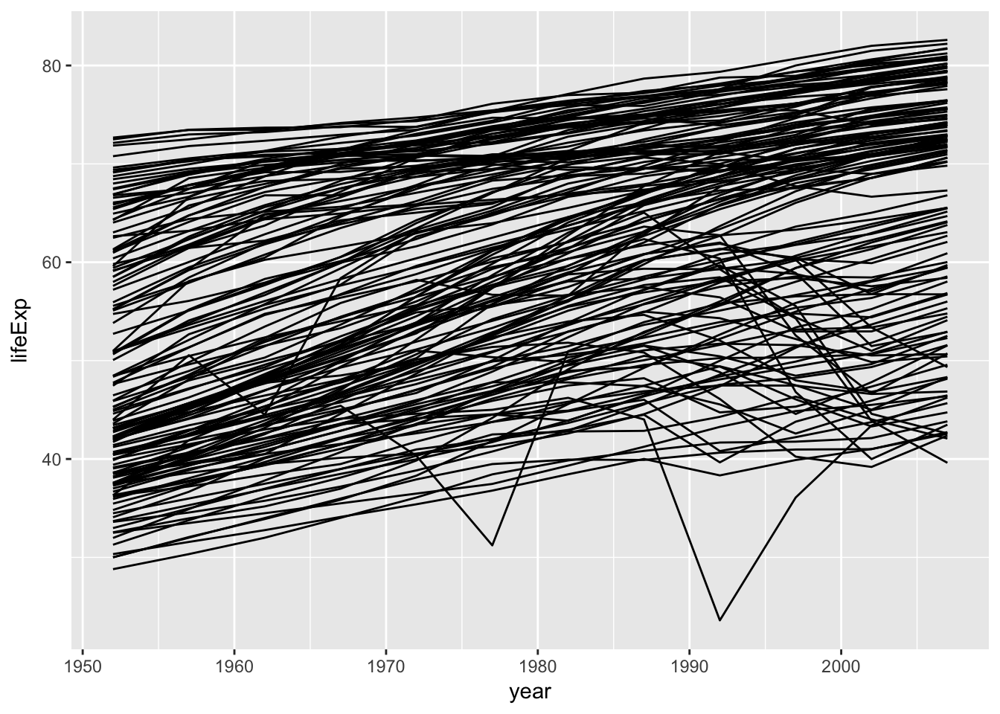
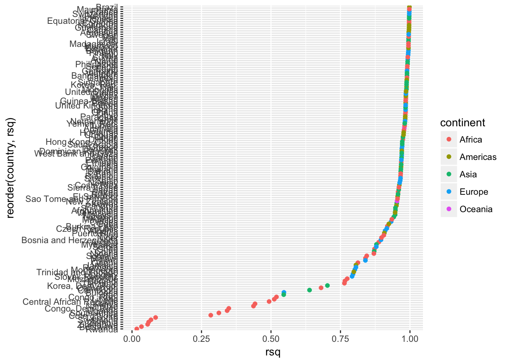
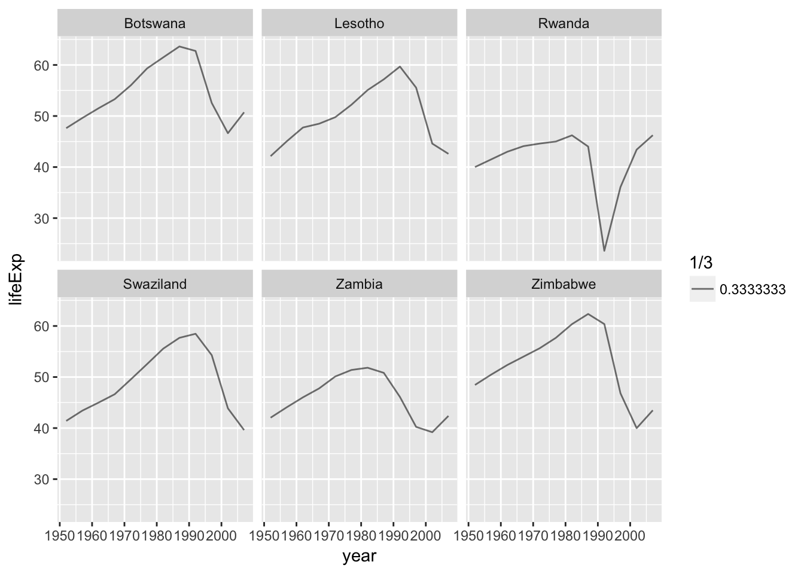
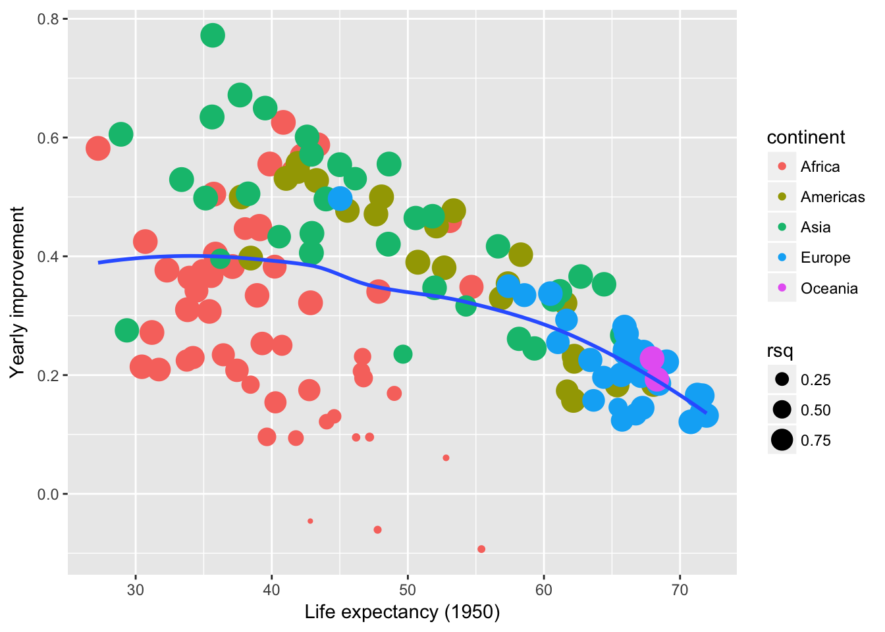
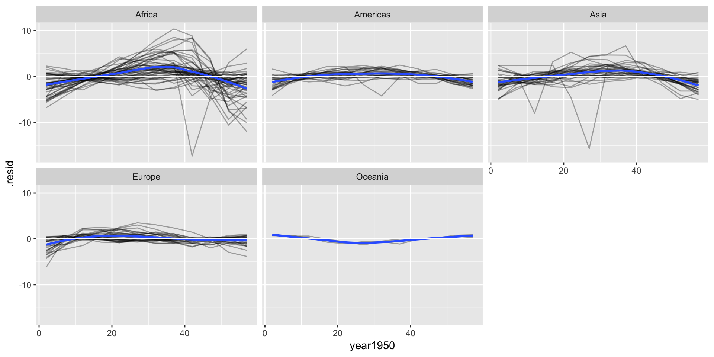

```
## # A tibble: 142 × 8
##    continent           country              data    model
##       <fctr>            <fctr>            <list>   <list>
## 1   Americas            Brazil <tibble [12 × 5]> <S3: lm>
## 2     Africa        Mauritania <tibble [12 × 5]> <S3: lm>
## 3     Europe            France <tibble [12 × 5]> <S3: lm>
## 4     Europe       Switzerland <tibble [12 × 5]> <S3: lm>
## 5       Asia          Pakistan <tibble [12 × 5]> <S3: lm>
## 6       Asia         Indonesia <tibble [12 × 5]> <S3: lm>
## 7     Africa Equatorial Guinea <tibble [12 × 5]> <S3: lm>
## 8     Africa           Comoros <tibble [12 × 5]> <S3: lm>
## 9   Americas         Nicaragua <tibble [12 × 5]> <S3: lm>
## 10  Americas         Guatemala <tibble [12 × 5]> <S3: lm>
## # ... with 132 more rows, and 4 more variables: glance <list>, rsq <dbl>,
## #   tidy <list>, augment <list>
```

```
## # A tibble: 52 × 8
##    continent                  country              data    model
##       <fctr>                   <fctr>            <list>   <list>
## 1     Africa                  Algeria <tibble [12 × 5]> <S3: lm>
## 2     Africa                   Angola <tibble [12 × 5]> <S3: lm>
## 3     Africa                    Benin <tibble [12 × 5]> <S3: lm>
## 4     Africa                 Botswana <tibble [12 × 5]> <S3: lm>
## 5     Africa             Burkina Faso <tibble [12 × 5]> <S3: lm>
## 6     Africa                  Burundi <tibble [12 × 5]> <S3: lm>
## 7     Africa                 Cameroon <tibble [12 × 5]> <S3: lm>
## 8     Africa Central African Republic <tibble [12 × 5]> <S3: lm>
## 9     Africa                     Chad <tibble [12 × 5]> <S3: lm>
## 10    Africa                  Comoros <tibble [12 × 5]> <S3: lm>
## # ... with 42 more rows, and 4 more variables: glance <list>, rsq <dbl>,
## #   tidy <list>, augment <list>
```


  
  
  
<!--html_preserve--><div id="htmlwidget-b2868664004c70f2521e" style="width:960px;height:480px;" class="plotly html-widget"></div>
<script type="application/json" data-for="htmlwidget-b2868664004c70f2521e">{"x":{"data":[{"x":[42.2364149184149],"y":[0.56927972027972],"text":"country: Algeria<br>year1950: 0.57","key":null,"type":"scatter","mode":"markers","marker":{"autocolorscale":false,"color":"rgba(248,118,109,1)","opacity":1,"size":22.5297894551698,"symbol":"circle","line":{"width":1.88976377952756,"color":"rgba(248,118,109,1)"}},"hoveron":"points","name":"(Africa,Algeria)","legendgroup":"(Africa,Algeria)","showlegend":true,"xaxis":"x","yaxis":"y","hoverinfo":"text"},{"x":[31.7079741258741],"y":[0.20933986013986],"text":"country: Angola<br>year1950: 0.21","key":null,"type":"scatter","mode":"markers","marker":{"autocolorscale":false,"color":"rgba(248,118,109,1)","opacity":1,"size":21.3882045222748,"symbol":"circle","line":{"width":1.88976377952756,"color":"rgba(248,118,109,1)"}},"hoveron":"points","name":"(Africa,Angola)","legendgroup":"(Africa,Angola)","showlegend":true,"xaxis":"x","yaxis":"y","hoverinfo":"text"},{"x":[38.9200470862471],"y":[0.334232867132867],"text":"country: Benin<br>year1950: 0.33","key":null,"type":"scatter","mode":"markers","marker":{"autocolorscale":false,"color":"rgba(248,118,109,1)","opacity":1,"size":22.3170621075691,"symbol":"circle","line":{"width":1.88976377952756,"color":"rgba(248,118,109,1)"}},"hoveron":"points","name":"(Africa,Benin)","legendgroup":"(Africa,Benin)","showlegend":true,"xaxis":"x","yaxis":"y","hoverinfo":"text"},{"x":[52.8077783216784],"y":[0.0606685314685308],"text":"country: Botswana<br>year1950: 0.06","key":null,"type":"scatter","mode":"markers","marker":{"autocolorscale":false,"color":"rgba(248,118,109,1)","opacity":1,"size":4.18699114542536,"symbol":"circle","line":{"width":1.88976377952756,"color":"rgba(248,118,109,1)"}},"hoveron":"points","name":"(Africa,Botswana)","legendgroup":"(Africa,Botswana)","showlegend":true,"xaxis":"x","yaxis":"y","hoverinfo":"text"},{"x":[33.9567426573427],"y":[0.363974825174825],"text":"country: Burkina Faso<br>year1950: 0.36","key":null,"type":"scatter","mode":"markers","marker":{"autocolorscale":false,"color":"rgba(248,118,109,1)","opacity":1,"size":21.7571757516792,"symbol":"circle","line":{"width":1.88976377952756,"color":"rgba(248,118,109,1)"}},"hoveron":"points","name":"(Africa,Burkina Faso)","legendgroup":"(Africa,Burkina Faso)","showlegend":true,"xaxis":"x","yaxis":"y","hoverinfo":"text"},{"x":[40.2703724941725],"y":[0.154134265734266],"text":"country: Burundi<br>year1950: 0.15","key":null,"type":"scatter","mode":"markers","marker":{"autocolorscale":false,"color":"rgba(248,118,109,1)","opacity":1,"size":19.8667315254861,"symbol":"circle","line":{"width":1.88976377952756,"color":"rgba(248,118,109,1)"}},"hoveron":"points","name":"(Africa,Burundi)","legendgroup":"(Africa,Burundi)","showlegend":true,"xaxis":"x","yaxis":"y","hoverinfo":"text"},{"x":[40.7491678321679],"y":[0.250146853146853],"text":"country: Cameroon<br>year1950: 0.25","key":null,"type":"scatter","mode":"markers","marker":{"autocolorscale":false,"color":"rgba(248,118,109,1)","opacity":1,"size":18.7208082833429,"symbol":"circle","line":{"width":1.88976377952756,"color":"rgba(248,118,109,1)"}},"hoveron":"points","name":"(Africa,Cameroon)","legendgroup":"(Africa,Cameroon)","showlegend":true,"xaxis":"x","yaxis":"y","hoverinfo":"text"},{"x":[38.4417016317017],"y":[0.183905594405594],"text":"country: Central African Republic<br>year1950: 0.18","key":null,"type":"scatter","mode":"markers","marker":{"autocolorscale":false,"color":"rgba(248,118,109,1)","opacity":1,"size":15.9420547338839,"symbol":"circle","line":{"width":1.88976377952756,"color":"rgba(248,118,109,1)"}},"hoveron":"points","name":"(Africa,Central African Republic)","legendgroup":"(Africa,Central African Republic)","showlegend":true,"xaxis":"x","yaxis":"y","hoverinfo":"text"},{"x":[39.3028836829837],"y":[0.253244055944055],"text":"country: Chad<br>year1950: 0.25","key":null,"type":"scatter","mode":"markers","marker":{"autocolorscale":false,"color":"rgba(248,118,109,1)","opacity":1,"size":21.201418106923,"symbol":"circle","line":{"width":1.88976377952756,"color":"rgba(248,118,109,1)"}},"hoveron":"points","name":"(Africa,Chad)","legendgroup":"(Africa,Chad)","showlegend":true,"xaxis":"x","yaxis":"y","hoverinfo":"text"},{"x":[39.0952181818182],"y":[0.450390909090909],"text":"country: Comoros<br>year1950: 0.45","key":null,"type":"scatter","mode":"markers","marker":{"autocolorscale":false,"color":"rgba(248,118,109,1)","opacity":1,"size":22.6635664027163,"symbol":"circle","line":{"width":1.88976377952756,"color":"rgba(248,118,109,1)"}},"hoveron":"points","name":"(Africa,Comoros)","legendgroup":"(Africa,Comoros)","showlegend":true,"xaxis":"x","yaxis":"y","hoverinfo":"text"},{"x":[41.7732461538462],"y":[0.0939153846153843],"text":"country: Congo, Dem. Rep.<br>year1950: 0.09","key":null,"type":"scatter","mode":"markers","marker":{"autocolorscale":false,"color":"rgba(248,118,109,1)","opacity":1,"size":13.3945859911147,"symbol":"circle","line":{"width":1.88976377952756,"color":"rgba(248,118,109,1)"}},"hoveron":"points","name":"(Africa,Congo, Dem. Rep.)","legendgroup":"(Africa,Congo, Dem. Rep.)","showlegend":true,"xaxis":"x","yaxis":"y","hoverinfo":"text"},{"x":[46.7465904428905],"y":[0.195095804195804],"text":"country: Congo, Rep.<br>year1950: 0.2","key":null,"type":"scatter","mode":"markers","marker":{"autocolorscale":false,"color":"rgba(248,118,109,1)","opacity":1,"size":16.3633851449457,"symbol":"circle","line":{"width":1.88976377952756,"color":"rgba(248,118,109,1)"}},"hoveron":"points","name":"(Africa,Congo, Rep.)","legendgroup":"(Africa,Congo, Rep.)","showlegend":true,"xaxis":"x","yaxis":"y","hoverinfo":"text"},{"x":[44.5847456876457],"y":[0.130556643356643],"text":"country: Cote d'Ivoire<br>year1950: 0.13","key":null,"type":"scatter","mode":"markers","marker":{"autocolorscale":false,"color":"rgba(248,118,109,1)","opacity":1,"size":12.0834780314543,"symbol":"circle","line":{"width":1.88976377952756,"color":"rgba(248,118,109,1)"}},"hoveron":"points","name":"(Africa,Cote d'Ivoire)","legendgroup":"(Africa,Cote d'Ivoire)","showlegend":true,"xaxis":"x","yaxis":"y","hoverinfo":"text"},{"x":[35.5423468531469],"y":[0.367403496503496],"text":"country: Djibouti<br>year1950: 0.37","key":null,"type":"scatter","mode":"markers","marker":{"autocolorscale":false,"color":"rgba(248,118,109,1)","opacity":1,"size":22.406572655956,"symbol":"circle","line":{"width":1.88976377952756,"color":"rgba(248,118,109,1)"}},"hoveron":"points","name":"(Africa,Djibouti)","legendgroup":"(Africa,Djibouti)","showlegend":true,"xaxis":"x","yaxis":"y","hoverinfo":"text"},{"x":[39.8570909090909],"y":[0.555454545454545],"text":"country: Egypt<br>year1950: 0.56","key":null,"type":"scatter","mode":"markers","marker":{"autocolorscale":false,"color":"rgba(248,118,109,1)","opacity":1,"size":22.589025699426,"symbol":"circle","line":{"width":1.88976377952756,"color":"rgba(248,118,109,1)"}},"hoveron":"points","name":"(Africa,Egypt)","legendgroup":"(Africa,Egypt)","showlegend":true,"xaxis":"x","yaxis":"y","hoverinfo":"text"},{"x":[33.8099664335664],"y":[0.310170629370629],"text":"country: Equatorial Guinea<br>year1950: 0.31","key":null,"type":"scatter","mode":"markers","marker":{"autocolorscale":false,"color":"rgba(248,118,109,1)","opacity":1,"size":22.6637696104524,"symbol":"circle","line":{"width":1.88976377952756,"color":"rgba(248,118,109,1)"}},"hoveron":"points","name":"(Africa,Equatorial Guinea)","legendgroup":"(Africa,Equatorial Guinea)","showlegend":true,"xaxis":"x","yaxis":"y","hoverinfo":"text"},{"x":[34.9458888111888],"y":[0.37469020979021],"text":"country: Eritrea<br>year1950: 0.37","key":null,"type":"scatter","mode":"markers","marker":{"autocolorscale":false,"color":"rgba(248,118,109,1)","opacity":1,"size":22.2091103442066,"symbol":"circle","line":{"width":1.88976377952756,"color":"rgba(248,118,109,1)"}},"hoveron":"points","name":"(Africa,Eritrea)","legendgroup":"(Africa,Eritrea)","showlegend":true,"xaxis":"x","yaxis":"y","hoverinfo":"text"},{"x":[35.4137832167832],"y":[0.307185314685314],"text":"country: Ethiopia<br>year1950: 0.31","key":null,"type":"scatter","mode":"markers","marker":{"autocolorscale":false,"color":"rgba(248,118,109,1)","opacity":1,"size":22.3389925166237,"symbol":"circle","line":{"width":1.88976377952756,"color":"rgba(248,118,109,1)"}},"hoveron":"points","name":"(Africa,Ethiopia)","legendgroup":"(Africa,Ethiopia)","showlegend":true,"xaxis":"x","yaxis":"y","hoverinfo":"text"},{"x":[38.0418804195804],"y":[0.446732867132867],"text":"country: Gabon<br>year1950: 0.45","key":null,"type":"scatter","mode":"markers","marker":{"autocolorscale":false,"color":"rgba(248,118,109,1)","opacity":1,"size":20.464257835569,"symbol":"circle","line":{"width":1.88976377952756,"color":"rgba(248,118,109,1)"}},"hoveron":"points","name":"(Africa,Gabon)","legendgroup":"(Africa,Gabon)","showlegend":true,"xaxis":"x","yaxis":"y","hoverinfo":"text"},{"x":[27.2367200466201],"y":[0.581825874125873],"text":"country: Gambia<br>year1950: 0.58","key":null,"type":"scatter","mode":"markers","marker":{"autocolorscale":false,"color":"rgba(248,118,109,1)","opacity":1,"size":22.5768346217402,"symbol":"circle","line":{"width":1.88976377952756,"color":"rgba(248,118,109,1)"}},"hoveron":"points","name":"(Africa,Gambia)","legendgroup":"(Africa,Gambia)","showlegend":true,"xaxis":"x","yaxis":"y","hoverinfo":"text"},{"x":[42.8492582750583],"y":[0.321742657342657],"text":"country: Ghana<br>year1950: 0.32","key":null,"type":"scatter","mode":"markers","marker":{"autocolorscale":false,"color":"rgba(248,118,109,1)","opacity":1,"size":22.5181400741155,"symbol":"circle","line":{"width":1.88976377952756,"color":"rgba(248,118,109,1)"}},"hoveron":"points","name":"(Africa,Ghana)","legendgroup":"(Africa,Ghana)","showlegend":true,"xaxis":"x","yaxis":"y","hoverinfo":"text"},{"x":[30.7073256410257],"y":[0.424830769230769],"text":"country: Guinea<br>year1950: 0.42","key":null,"type":"scatter","mode":"markers","marker":{"autocolorscale":false,"color":"rgba(248,118,109,1)","opacity":1,"size":22.4518729138677,"symbol":"circle","line":{"width":1.88976377952756,"color":"rgba(248,118,109,1)"}},"hoveron":"points","name":"(Africa,Guinea)","legendgroup":"(Africa,Guinea)","showlegend":true,"xaxis":"x","yaxis":"y","hoverinfo":"text"},{"x":[31.1935321678322],"y":[0.271753146853147],"text":"country: Guinea-Bissau<br>year1950: 0.27","key":null,"type":"scatter","mode":"markers","marker":{"autocolorscale":false,"color":"rgba(248,118,109,1)","opacity":1,"size":22.5233972842697,"symbol":"circle","line":{"width":1.88976377952756,"color":"rgba(248,118,109,1)"}},"hoveron":"points","name":"(Africa,Guinea-Bissau)","legendgroup":"(Africa,Guinea-Bissau)","showlegend":true,"xaxis":"x","yaxis":"y","hoverinfo":"text"},{"x":[46.5890230769231],"y":[0.206507692307692],"text":"country: Kenya<br>year1950: 0.21","key":null,"type":"scatter","mode":"markers","marker":{"autocolorscale":false,"color":"rgba(248,118,109,1)","opacity":1,"size":15.1007294857864,"symbol":"circle","line":{"width":1.88976377952756,"color":"rgba(248,118,109,1)"}},"hoveron":"points","name":"(Africa,Kenya)","legendgroup":"(Africa,Kenya)","showlegend":true,"xaxis":"x","yaxis":"y","hoverinfo":"text"},{"x":[47.1878941724942],"y":[0.0955657342657339],"text":"country: Lesotho<br>year1950: 0.1","key":null,"type":"scatter","mode":"markers","marker":{"autocolorscale":false,"color":"rgba(248,118,109,1)","opacity":1,"size":6.61234283548747,"symbol":"circle","line":{"width":1.88976377952756,"color":"rgba(248,118,109,1)"}},"hoveron":"points","name":"(Africa,Lesotho)","legendgroup":"(Africa,Lesotho)","showlegend":true,"xaxis":"x","yaxis":"y","hoverinfo":"text"},{"x":[39.6444356643357],"y":[0.0959937062937062],"text":"country: Liberia<br>year1950: 0.1","key":null,"type":"scatter","mode":"markers","marker":{"autocolorscale":false,"color":"rgba(248,118,109,1)","opacity":1,"size":16.2384592483966,"symbol":"circle","line":{"width":1.88976377952756,"color":"rgba(248,118,109,1)"}},"hoveron":"points","name":"(Africa,Liberia)","legendgroup":"(Africa,Liberia)","showlegend":true,"xaxis":"x","yaxis":"y","hoverinfo":"text"},{"x":[40.8508645687646],"y":[0.625535664335664],"text":"country: Libya<br>year1950: 0.63","key":null,"type":"scatter","mode":"markers","marker":{"autocolorscale":false,"color":"rgba(248,118,109,1)","opacity":1,"size":22.5093603414741,"symbol":"circle","line":{"width":1.88976377952756,"color":"rgba(248,118,109,1)"}},"hoveron":"points","name":"(Africa,Libya)","legendgroup":"(Africa,Libya)","showlegend":true,"xaxis":"x","yaxis":"y","hoverinfo":"text"},{"x":[35.8606081585082],"y":[0.403727972027972],"text":"country: Madagascar<br>year1950: 0.4","key":null,"type":"scatter","mode":"markers","marker":{"autocolorscale":false,"color":"rgba(248,118,109,1)","opacity":1,"size":22.6385766717413,"symbol":"circle","line":{"width":1.88976377952756,"color":"rgba(248,118,109,1)"}},"hoveron":"points","name":"(Africa,Madagascar)","legendgroup":"(Africa,Madagascar)","showlegend":true,"xaxis":"x","yaxis":"y","hoverinfo":"text"},{"x":[36.4419200466201],"y":[0.234225874125874],"text":"country: Malawi<br>year1950: 0.23","key":null,"type":"scatter","mode":"markers","marker":{"autocolorscale":false,"color":"rgba(248,118,109,1)","opacity":1,"size":20.8037224331762,"symbol":"circle","line":{"width":1.88976377952756,"color":"rgba(248,118,109,1)"}},"hoveron":"points","name":"(Africa,Malawi)","legendgroup":"(Africa,Malawi)","showlegend":true,"xaxis":"x","yaxis":"y","hoverinfo":"text"},{"x":[32.2976111888112],"y":[0.37680979020979],"text":"country: Mali<br>year1950: 0.38","key":null,"type":"scatter","mode":"markers","marker":{"autocolorscale":false,"color":"rgba(248,118,109,1)","opacity":1,"size":22.6476534866929,"symbol":"circle","line":{"width":1.88976377952756,"color":"rgba(248,118,109,1)"}},"hoveron":"points","name":"(Africa,Mali)","legendgroup":"(Africa,Mali)","showlegend":true,"xaxis":"x","yaxis":"y","hoverinfo":"text"},{"x":[39.1327675990676],"y":[0.446417482517482],"text":"country: Mauritania<br>year1950: 0.45","key":null,"type":"scatter","mode":"markers","marker":{"autocolorscale":false,"color":"rgba(248,118,109,1)","opacity":1,"size":22.6729260420484,"symbol":"circle","line":{"width":1.88976377952756,"color":"rgba(248,118,109,1)"}},"hoveron":"points","name":"(Africa,Mauritania)","legendgroup":"(Africa,Mauritania)","showlegend":true,"xaxis":"x","yaxis":"y","hoverinfo":"text"},{"x":[54.6738615384616],"y":[0.348453846153846],"text":"country: Mauritius<br>year1950: 0.35","key":null,"type":"scatter","mode":"markers","marker":{"autocolorscale":false,"color":"rgba(248,118,109,1)","opacity":1,"size":21.9466858486395,"symbol":"circle","line":{"width":1.88976377952756,"color":"rgba(248,118,109,1)"}},"hoveron":"points","name":"(Africa,Mauritius)","legendgroup":"(Africa,Mauritius)","showlegend":true,"xaxis":"x","yaxis":"y","hoverinfo":"text"},{"x":[41.6058878787879],"y":[0.542472727272727],"text":"country: Morocco<br>year1950: 0.54","key":null,"type":"scatter","mode":"markers","marker":{"autocolorscale":false,"color":"rgba(248,118,109,1)","opacity":1,"size":22.6377741029799,"symbol":"circle","line":{"width":1.88976377952756,"color":"rgba(248,118,109,1)"}},"hoveron":"points","name":"(Africa,Morocco)","legendgroup":"(Africa,Morocco)","showlegend":true,"xaxis":"x","yaxis":"y","hoverinfo":"text"},{"x":[33.7571832167832],"y":[0.224485314685315],"text":"country: Mozambique<br>year1950: 0.22","key":null,"type":"scatter","mode":"markers","marker":{"autocolorscale":false,"color":"rgba(248,118,109,1)","opacity":1,"size":19.9738603215456,"symbol":"circle","line":{"width":1.88976377952756,"color":"rgba(248,118,109,1)"}},"hoveron":"points","name":"(Africa,Mozambique)","legendgroup":"(Africa,Mozambique)","showlegend":true,"xaxis":"x","yaxis":"y","hoverinfo":"text"},{"x":[46.6720060606061],"y":[0.231163636363636],"text":"country: Namibia<br>year1950: 0.23","key":null,"type":"scatter","mode":"markers","marker":{"autocolorscale":false,"color":"rgba(248,118,109,1)","opacity":1,"size":15.0059898253153,"symbol":"circle","line":{"width":1.88976377952756,"color":"rgba(248,118,109,1)"}},"hoveron":"points","name":"(Africa,Namibia)","legendgroup":"(Africa,Namibia)","showlegend":true,"xaxis":"x","yaxis":"y","hoverinfo":"text"},{"x":[34.4664484848485],"y":[0.34210909090909],"text":"country: Niger<br>year1950: 0.34","key":null,"type":"scatter","mode":"markers","marker":{"autocolorscale":false,"color":"rgba(248,118,109,1)","opacity":1,"size":21.5067883669501,"symbol":"circle","line":{"width":1.88976377952756,"color":"rgba(248,118,109,1)"}},"hoveron":"points","name":"(Africa,Niger)","legendgroup":"(Africa,Niger)","showlegend":true,"xaxis":"x","yaxis":"y","hoverinfo":"text"},{"x":[37.4433941724942],"y":[0.208065734265734],"text":"country: Nigeria<br>year1950: 0.21","key":null,"type":"scatter","mode":"markers","marker":{"autocolorscale":false,"color":"rgba(248,118,109,1)","opacity":1,"size":21.1738109386649,"symbol":"circle","line":{"width":1.88976377952756,"color":"rgba(248,118,109,1)"}},"hoveron":"points","name":"(Africa,Nigeria)","legendgroup":"(Africa,Nigeria)","showlegend":true,"xaxis":"x","yaxis":"y","hoverinfo":"text"},{"x":[53.0777776223777],"y":[0.459880419580419],"text":"country: Reunion<br>year1950: 0.46","key":null,"type":"scatter","mode":"markers","marker":{"autocolorscale":false,"color":"rgba(248,118,109,1)","opacity":1,"size":22.3109407670015,"symbol":"circle","line":{"width":1.88976377952756,"color":"rgba(248,118,109,1)"}},"hoveron":"points","name":"(Africa,Reunion)","legendgroup":"(Africa,Reunion)","showlegend":true,"xaxis":"x","yaxis":"y","hoverinfo":"text"},{"x":[42.8336116550117],"y":[-0.0458314685314688],"text":"country: Rwanda<br>year1950: -0.05","key":null,"type":"scatter","mode":"markers","marker":{"autocolorscale":false,"color":"rgba(248,118,109,1)","opacity":1,"size":2.97349498492615,"symbol":"circle","line":{"width":1.88976377952756,"color":"rgba(248,118,109,1)"}},"hoveron":"points","name":"(Africa,Rwanda)","legendgroup":"(Africa,Rwanda)","showlegend":true,"xaxis":"x","yaxis":"y","hoverinfo":"text"},{"x":[47.8461990675991],"y":[0.340682517482517],"text":"country: Sao Tome and Principe<br>year1950: 0.34","key":null,"type":"scatter","mode":"markers","marker":{"autocolorscale":false,"color":"rgba(248,118,109,1)","opacity":1,"size":22.1857354719987,"symbol":"circle","line":{"width":1.88976377952756,"color":"rgba(248,118,109,1)"}},"hoveron":"points","name":"(Africa,Sao Tome and Principe)","legendgroup":"(Africa,Sao Tome and Principe)","showlegend":true,"xaxis":"x","yaxis":"y","hoverinfo":"text"},{"x":[35.7372666666667],"y":[0.504699999999999],"text":"country: Senegal<br>year1950: 0.5","key":null,"type":"scatter","mode":"markers","marker":{"autocolorscale":false,"color":"rgba(248,118,109,1)","opacity":1,"size":22.5917619379356,"symbol":"circle","line":{"width":1.88976377952756,"color":"rgba(248,118,109,1)"}},"hoveron":"points","name":"(Africa,Senegal)","legendgroup":"(Africa,Senegal)","showlegend":true,"xaxis":"x","yaxis":"y","hoverinfo":"text"},{"x":[30.4551351981352],"y":[0.214034965034965],"text":"country: Sierra Leone<br>year1950: 0.21","key":null,"type":"scatter","mode":"markers","marker":{"autocolorscale":false,"color":"rgba(248,118,109,1)","opacity":1,"size":22.2424613825837,"symbol":"circle","line":{"width":1.88976377952756,"color":"rgba(248,118,109,1)"}},"hoveron":"points","name":"(Africa,Sierra Leone)","legendgroup":"(Africa,Sierra Leone)","showlegend":true,"xaxis":"x","yaxis":"y","hoverinfo":"text"},{"x":[34.2162505827506],"y":[0.229573426573426],"text":"country: Somalia<br>year1950: 0.23","key":null,"type":"scatter","mode":"markers","marker":{"autocolorscale":false,"color":"rgba(248,118,109,1)","opacity":1,"size":20.8590562551849,"symbol":"circle","line":{"width":1.88976377952756,"color":"rgba(248,118,109,1)"}},"hoveron":"points","name":"(Africa,Somalia)","legendgroup":"(Africa,Somalia)","showlegend":true,"xaxis":"x","yaxis":"y","hoverinfo":"text"},{"x":[49.0029631701632],"y":[0.16915944055944],"text":"country: South Africa<br>year1950: 0.17","key":null,"type":"scatter","mode":"markers","marker":{"autocolorscale":false,"color":"rgba(248,118,109,1)","opacity":1,"size":12.6886788944178,"symbol":"circle","line":{"width":1.88976377952756,"color":"rgba(248,118,109,1)"}},"hoveron":"points","name":"(Africa,South Africa)","legendgroup":"(Africa,South Africa)","showlegend":true,"xaxis":"x","yaxis":"y","hoverinfo":"text"},{"x":[37.1086426573426],"y":[0.382774825174825],"text":"country: Sudan<br>year1950: 0.38","key":null,"type":"scatter","mode":"markers","marker":{"autocolorscale":false,"color":"rgba(248,118,109,1)","opacity":1,"size":22.609980656883,"symbol":"circle","line":{"width":1.88976377952756,"color":"rgba(248,118,109,1)"}},"hoveron":"points","name":"(Africa,Sudan)","legendgroup":"(Africa,Sudan)","showlegend":true,"xaxis":"x","yaxis":"y","hoverinfo":"text"},{"x":[46.1977093240093],"y":[0.0950748251748249],"text":"country: Swaziland<br>year1950: 0.1","key":null,"type":"scatter","mode":"markers","marker":{"autocolorscale":false,"color":"rgba(248,118,109,1)","opacity":1,"size":5.92843369043804,"symbol":"circle","line":{"width":1.88976377952756,"color":"rgba(248,118,109,1)"}},"hoveron":"points","name":"(Africa,Swaziland)","legendgroup":"(Africa,Swaziland)","showlegend":true,"xaxis":"x","yaxis":"y","hoverinfo":"text"},{"x":[42.759034032634],"y":[0.174688111888112],"text":"country: Tanzania<br>year1950: 0.17","key":null,"type":"scatter","mode":"markers","marker":{"autocolorscale":false,"color":"rgba(248,118,109,1)","opacity":1,"size":19.8436714586064,"symbol":"circle","line":{"width":1.88976377952756,"color":"rgba(248,118,109,1)"}},"hoveron":"points","name":"(Africa,Tanzania)","legendgroup":"(Africa,Tanzania)","showlegend":true,"xaxis":"x","yaxis":"y","hoverinfo":"text"},{"x":[40.2122769230769],"y":[0.382592307692307],"text":"country: Togo<br>year1950: 0.38","key":null,"type":"scatter","mode":"markers","marker":{"autocolorscale":false,"color":"rgba(248,118,109,1)","opacity":1,"size":21.6038041428618,"symbol":"circle","line":{"width":1.88976377952756,"color":"rgba(248,118,109,1)"}},"hoveron":"points","name":"(Africa,Togo)","legendgroup":"(Africa,Togo)","showlegend":true,"xaxis":"x","yaxis":"y","hoverinfo":"text"},{"x":[43.379620979021],"y":[0.587843356643356],"text":"country: Tunisia<br>year1950: 0.59","key":null,"type":"scatter","mode":"markers","marker":{"autocolorscale":false,"color":"rgba(248,118,109,1)","opacity":1,"size":22.4792698816159,"symbol":"circle","line":{"width":1.88976377952756,"color":"rgba(248,118,109,1)"}},"hoveron":"points","name":"(Africa,Tunisia)","legendgroup":"(Africa,Tunisia)","showlegend":true,"xaxis":"x","yaxis":"y","hoverinfo":"text"},{"x":[44.0320459207459],"y":[0.121586013986014],"text":"country: Uganda<br>year1950: 0.12","key":null,"type":"scatter","mode":"markers","marker":{"autocolorscale":false,"color":"rgba(248,118,109,1)","opacity":1,"size":13.2777313257957,"symbol":"circle","line":{"width":1.88976377952756,"color":"rgba(248,118,109,1)"}},"hoveron":"points","name":"(Africa,Uganda)","legendgroup":"(Africa,Uganda)","showlegend":true,"xaxis":"x","yaxis":"y","hoverinfo":"text"},{"x":[47.778875990676],"y":[-0.0604251748251749],"text":"country: Zambia<br>year1950: -0.06","key":null,"type":"scatter","mode":"markers","marker":{"autocolorscale":false,"color":"rgba(248,118,109,1)","opacity":1,"size":5.55259564585979,"symbol":"circle","line":{"width":1.88976377952756,"color":"rgba(248,118,109,1)"}},"hoveron":"points","name":"(Africa,Zambia)","legendgroup":"(Africa,Zambia)","showlegend":true,"xaxis":"x","yaxis":"y","hoverinfo":"text"},{"x":[55.4072855477856],"y":[-0.0930209790209793],"text":"country: Zimbabwe<br>year1950: -0.09","key":null,"type":"scatter","mode":"markers","marker":{"autocolorscale":false,"color":"rgba(248,118,109,1)","opacity":1,"size":5.38275727113358,"symbol":"circle","line":{"width":1.88976377952756,"color":"rgba(248,118,109,1)"}},"hoveron":"points","name":"(Africa,Zimbabwe)","legendgroup":"(Africa,Zimbabwe)","showlegend":true,"xaxis":"x","yaxis":"y","hoverinfo":"text"},{"x":[62.2250191142191],"y":[0.231708391608391],"text":"country: Argentina<br>year1950: 0.23","key":null,"type":"scatter","mode":"markers","marker":{"autocolorscale":false,"color":"rgba(163,165,0,1)","opacity":1,"size":22.6489808743717,"symbol":"circle","line":{"width":1.88976377952756,"color":"rgba(163,165,0,1)"}},"hoveron":"points","name":"(Americas,Argentina)","legendgroup":"(Americas,Argentina)","showlegend":true,"xaxis":"x","yaxis":"y","hoverinfo":"text"},{"x":[37.7565843822844],"y":[0.499932167832167],"text":"country: Bolivia<br>year1950: 0.5","key":null,"type":"scatter","mode":"markers","marker":{"autocolorscale":false,"color":"rgba(163,165,0,1)","opacity":1,"size":22.5232059219205,"symbol":"circle","line":{"width":1.88976377952756,"color":"rgba(163,165,0,1)"}},"hoveron":"points","name":"(Americas,Bolivia)","legendgroup":"(Americas,Bolivia)","showlegend":true,"xaxis":"x","yaxis":"y","hoverinfo":"text"},{"x":[50.7318594405595],"y":[0.39008951048951],"text":"country: Brazil<br>year1950: 0.39","key":null,"type":"scatter","mode":"markers","marker":{"autocolorscale":false,"color":"rgba(163,165,0,1)","opacity":1,"size":22.6771653543307,"symbol":"circle","line":{"width":1.88976377952756,"color":"rgba(163,165,0,1)"}},"hoveron":"points","name":"(Americas,Brazil)","legendgroup":"(Americas,Brazil)","showlegend":true,"xaxis":"x","yaxis":"y","hoverinfo":"text"},{"x":[68.4461076923077],"y":[0.21886923076923],"text":"country: Canada<br>year1950: 0.22","key":null,"type":"scatter","mode":"markers","marker":{"autocolorscale":false,"color":"rgba(163,165,0,1)","opacity":1,"size":22.6582770431168,"symbol":"circle","line":{"width":1.88976377952756,"color":"rgba(163,165,0,1)"}},"hoveron":"points","name":"(Americas,Canada)","legendgroup":"(Americas,Canada)","showlegend":true,"xaxis":"x","yaxis":"y","hoverinfo":"text"},{"x":[53.364017016317],"y":[0.476844055944055],"text":"country: Chile<br>year1950: 0.48","key":null,"type":"scatter","mode":"markers","marker":{"autocolorscale":false,"color":"rgba(163,165,0,1)","opacity":1,"size":22.5032431673531,"symbol":"circle","line":{"width":1.88976377952756,"color":"rgba(163,165,0,1)"}},"hoveron":"points","name":"(Americas,Chile)","legendgroup":"(Americas,Chile)","showlegend":true,"xaxis":"x","yaxis":"y","hoverinfo":"text"},{"x":[52.6656146853147],"y":[0.380750349650349],"text":"country: Colombia<br>year1950: 0.38","key":null,"type":"scatter","mode":"markers","marker":{"autocolorscale":false,"color":"rgba(163,165,0,1)","opacity":1,"size":22.3317350664247,"symbol":"circle","line":{"width":1.88976377952756,"color":"rgba(163,165,0,1)"}},"hoveron":"points","name":"(Americas,Colombia)","legendgroup":"(Americas,Colombia)","showlegend":true,"xaxis":"x","yaxis":"y","hoverinfo":"text"},{"x":[58.2991261072261],"y":[0.40278951048951],"text":"country: Costa Rica<br>year1950: 0.4","key":null,"type":"scatter","mode":"markers","marker":{"autocolorscale":false,"color":"rgba(163,165,0,1)","opacity":1,"size":22.260952941859,"symbol":"circle","line":{"width":1.88976377952756,"color":"rgba(163,165,0,1)"}},"hoveron":"points","name":"(Americas,Costa Rica)","legendgroup":"(Americas,Costa Rica)","showlegend":true,"xaxis":"x","yaxis":"y","hoverinfo":"text"},{"x":[61.571148018648],"y":[0.321150349650349],"text":"country: Cuba<br>year1950: 0.32","key":null,"type":"scatter","mode":"markers","marker":{"autocolorscale":false,"color":"rgba(163,165,0,1)","opacity":1,"size":21.820512618432,"symbol":"circle","line":{"width":1.88976377952756,"color":"rgba(163,165,0,1)"}},"hoveron":"points","name":"(Americas,Cuba)","legendgroup":"(Americas,Cuba)","showlegend":true,"xaxis":"x","yaxis":"y","hoverinfo":"text"},{"x":[47.6555027972028],"y":[0.471152447552447],"text":"country: Dominican Republic<br>year1950: 0.47","key":null,"type":"scatter","mode":"markers","marker":{"autocolorscale":false,"color":"rgba(163,165,0,1)","opacity":1,"size":22.3632578676733,"symbol":"circle","line":{"width":1.88976377952756,"color":"rgba(163,165,0,1)"}},"hoveron":"points","name":"(Americas,Dominican Republic)","legendgroup":"(Americas,Dominican Republic)","showlegend":true,"xaxis":"x","yaxis":"y","hoverinfo":"text"},{"x":[48.0652655011655],"y":[0.500053146853146],"text":"country: Ecuador<br>year1950: 0.5","key":null,"type":"scatter","mode":"markers","marker":{"autocolorscale":false,"color":"rgba(163,165,0,1)","opacity":1,"size":22.6375822019118,"symbol":"circle","line":{"width":1.88976377952756,"color":"rgba(163,165,0,1)"}},"hoveron":"points","name":"(Americas,Ecuador)","legendgroup":"(Americas,Ecuador)","showlegend":true,"xaxis":"x","yaxis":"y","hoverinfo":"text"},{"x":[45.5576662004662],"y":[0.477141258741258],"text":"country: El Salvador<br>year1950: 0.48","key":null,"type":"scatter","mode":"markers","marker":{"autocolorscale":false,"color":"rgba(163,165,0,1)","opacity":1,"size":22.1905267754172,"symbol":"circle","line":{"width":1.88976377952756,"color":"rgba(163,165,0,1)"}},"hoveron":"points","name":"(Americas,El Salvador)","legendgroup":"(Americas,El Salvador)","showlegend":true,"xaxis":"x","yaxis":"y","hoverinfo":"text"},{"x":[41.0568505827506],"y":[0.531273426573426],"text":"country: Guatemala<br>year1950: 0.53","key":null,"type":"scatter","mode":"markers","marker":{"autocolorscale":false,"color":"rgba(163,165,0,1)","opacity":1,"size":22.6614406202447,"symbol":"circle","line":{"width":1.88976377952756,"color":"rgba(163,165,0,1)"}},"hoveron":"points","name":"(Americas,Guatemala)","legendgroup":"(Americas,Guatemala)","showlegend":true,"xaxis":"x","yaxis":"y","hoverinfo":"text"},{"x":[38.4520377622378],"y":[0.397058041958041],"text":"country: Haiti<br>year1950: 0.4","key":null,"type":"scatter","mode":"markers","marker":{"autocolorscale":false,"color":"rgba(163,165,0,1)","opacity":1,"size":22.5583152480791,"symbol":"circle","line":{"width":1.88976377952756,"color":"rgba(163,165,0,1)"}},"hoveron":"points","name":"(Americas,Haiti)","legendgroup":"(Americas,Haiti)","showlegend":true,"xaxis":"x","yaxis":"y","hoverinfo":"text"},{"x":[41.9067067599068],"y":[0.542851748251748],"text":"country: Honduras<br>year1950: 0.54","key":null,"type":"scatter","mode":"markers","marker":{"autocolorscale":false,"color":"rgba(163,165,0,1)","opacity":1,"size":22.4402239032961,"symbol":"circle","line":{"width":1.88976377952756,"color":"rgba(163,165,0,1)"}},"hoveron":"points","name":"(Americas,Honduras)","legendgroup":"(Americas,Honduras)","showlegend":true,"xaxis":"x","yaxis":"y","hoverinfo":"text"},{"x":[62.2181983682984],"y":[0.221394405594405],"text":"country: Jamaica<br>year1950: 0.22","key":null,"type":"scatter","mode":"markers","marker":{"autocolorscale":false,"color":"rgba(163,165,0,1)","opacity":1,"size":20.374587321159,"symbol":"circle","line":{"width":1.88976377952756,"color":"rgba(163,165,0,1)"}},"hoveron":"points","name":"(Americas,Jamaica)","legendgroup":"(Americas,Jamaica)","showlegend":true,"xaxis":"x","yaxis":"y","hoverinfo":"text"},{"x":[52.1033018648019],"y":[0.451034965034965],"text":"country: Mexico<br>year1950: 0.45","key":null,"type":"scatter","mode":"markers","marker":{"autocolorscale":false,"color":"rgba(163,165,0,1)","opacity":1,"size":22.5307868870711,"symbol":"circle","line":{"width":1.88976377952756,"color":"rgba(163,165,0,1)"}},"hoveron":"points","name":"(Americas,Mexico)","legendgroup":"(Americas,Mexico)","showlegend":true,"xaxis":"x","yaxis":"y","hoverinfo":"text"},{"x":[41.9320890442891],"y":[0.55651958041958],"text":"country: Nicaragua<br>year1950: 0.56","key":null,"type":"scatter","mode":"markers","marker":{"autocolorscale":false,"color":"rgba(163,165,0,1)","opacity":1,"size":22.6627182009924,"symbol":"circle","line":{"width":1.88976377952756,"color":"rgba(163,165,0,1)"}},"hoveron":"points","name":"(Americas,Nicaragua)","legendgroup":"(Americas,Nicaragua)","showlegend":true,"xaxis":"x","yaxis":"y","hoverinfo":"text"},{"x":[57.3525818181818],"y":[0.354209090909091],"text":"country: Panama<br>year1950: 0.35","key":null,"type":"scatter","mode":"markers","marker":{"autocolorscale":false,"color":"rgba(163,165,0,1)","opacity":1,"size":22.1384900051178,"symbol":"circle","line":{"width":1.88976377952756,"color":"rgba(163,165,0,1)"}},"hoveron":"points","name":"(Americas,Panama)","legendgroup":"(Americas,Panama)","showlegend":true,"xaxis":"x","yaxis":"y","hoverinfo":"text"},{"x":[62.1671242424243],"y":[0.157354545454545],"text":"country: Paraguay<br>year1950: 0.16","key":null,"type":"scatter","mode":"markers","marker":{"autocolorscale":false,"color":"rgba(163,165,0,1)","opacity":1,"size":22.5054114105913,"symbol":"circle","line":{"width":1.88976377952756,"color":"rgba(163,165,0,1)"}},"hoveron":"points","name":"(Americas,Paraguay)","legendgroup":"(Americas,Paraguay)","showlegend":true,"xaxis":"x","yaxis":"y","hoverinfo":"text"},{"x":[43.2922452214453],"y":[0.527697902097902],"text":"country: Peru<br>year1950: 0.53","key":null,"type":"scatter","mode":"markers","marker":{"autocolorscale":false,"color":"rgba(163,165,0,1)","opacity":1,"size":22.5681420614416,"symbol":"circle","line":{"width":1.88976377952756,"color":"rgba(163,165,0,1)"}},"hoveron":"points","name":"(Americas,Peru)","legendgroup":"(Americas,Peru)","showlegend":true,"xaxis":"x","yaxis":"y","hoverinfo":"text"},{"x":[66.527375990676],"y":[0.210574825174824],"text":"country: Puerto Rico<br>year1950: 0.21","key":null,"type":"scatter","mode":"markers","marker":{"autocolorscale":false,"color":"rgba(163,165,0,1)","opacity":1,"size":21.6278247845337,"symbol":"circle","line":{"width":1.88976377952756,"color":"rgba(163,165,0,1)"}},"hoveron":"points","name":"(Americas,Puerto Rico)","legendgroup":"(Americas,Puerto Rico)","showlegend":true,"xaxis":"x","yaxis":"y","hoverinfo":"text"},{"x":[61.7049846153846],"y":[0.173661538461538],"text":"country: Trinidad and Tobago<br>year1950: 0.17","key":null,"type":"scatter","mode":"markers","marker":{"autocolorscale":false,"color":"rgba(163,165,0,1)","opacity":1,"size":20.2776046419367,"symbol":"circle","line":{"width":1.88976377952756,"color":"rgba(163,165,0,1)"}},"hoveron":"points","name":"(Americas,Trinidad and Tobago)","legendgroup":"(Americas,Trinidad and Tobago)","showlegend":true,"xaxis":"x","yaxis":"y","hoverinfo":"text"},{"x":[68.0455076923077],"y":[0.184169230769231],"text":"country: United States<br>year1950: 0.18","key":null,"type":"scatter","mode":"markers","marker":{"autocolorscale":false,"color":"rgba(163,165,0,1)","opacity":1,"size":22.538969322528,"symbol":"circle","line":{"width":1.88976377952756,"color":"rgba(163,165,0,1)"}},"hoveron":"points","name":"(Americas,United States)","legendgroup":"(Americas,United States)","showlegend":true,"xaxis":"x","yaxis":"y","hoverinfo":"text"},{"x":[65.3750585081585],"y":[0.183272027972027],"text":"country: Uruguay<br>year1950: 0.18","key":null,"type":"scatter","mode":"markers","marker":{"autocolorscale":false,"color":"rgba(163,165,0,1)","opacity":1,"size":22.4348326215184,"symbol":"circle","line":{"width":1.88976377952756,"color":"rgba(163,165,0,1)"}},"hoveron":"points","name":"(Americas,Uruguay)","legendgroup":"(Americas,Uruguay)","showlegend":true,"xaxis":"x","yaxis":"y","hoverinfo":"text"},{"x":[56.8538771561772],"y":[0.329721678321678],"text":"country: Venezuela<br>year1950: 0.33","key":null,"type":"scatter","mode":"markers","marker":{"autocolorscale":false,"color":"rgba(163,165,0,1)","opacity":1,"size":22.084088068791,"symbol":"circle","line":{"width":1.88976377952756,"color":"rgba(163,165,0,1)"}},"hoveron":"points","name":"(Americas,Venezuela)","legendgroup":"(Americas,Venezuela)","showlegend":true,"xaxis":"x","yaxis":"y","hoverinfo":"text"},{"x":[29.3566375291376],"y":[0.275328671328671],"text":"country: Afghanistan<br>year1950: 0.28","key":null,"type":"scatter","mode":"markers","marker":{"autocolorscale":false,"color":"rgba(0,191,125,1)","opacity":1,"size":22.097921603322,"symbol":"circle","line":{"width":1.88976377952756,"color":"rgba(0,191,125,1)"}},"hoveron":"points","name":"(Asia,Afghanistan)","legendgroup":"(Asia,Afghanistan)","showlegend":true,"xaxis":"x","yaxis":"y","hoverinfo":"text"},{"x":[51.8141897435898],"y":[0.467507692307692],"text":"country: Bahrain<br>year1950: 0.47","key":null,"type":"scatter","mode":"markers","marker":{"autocolorscale":false,"color":"rgba(0,191,125,1)","opacity":1,"size":22.318653066505,"symbol":"circle","line":{"width":1.88976377952756,"color":"rgba(0,191,125,1)"}},"hoveron":"points","name":"(Asia,Bahrain)","legendgroup":"(Asia,Bahrain)","showlegend":true,"xaxis":"x","yaxis":"y","hoverinfo":"text"},{"x":[35.1392256410256],"y":[0.498130769230769],"text":"country: Bangladesh<br>year1950: 0.5","key":null,"type":"scatter","mode":"markers","marker":{"autocolorscale":false,"color":"rgba(0,191,125,1)","opacity":1,"size":22.5782638718645,"symbol":"circle","line":{"width":1.88976377952756,"color":"rgba(0,191,125,1)"}},"hoveron":"points","name":"(Asia,Bangladesh)","legendgroup":"(Asia,Bangladesh)","showlegend":true,"xaxis":"x","yaxis":"y","hoverinfo":"text"},{"x":[36.2236174825175],"y":[0.395902797202797],"text":"country: Cambodia<br>year1950: 0.4","key":null,"type":"scatter","mode":"markers","marker":{"autocolorscale":false,"color":"rgba(0,191,125,1)","opacity":1,"size":18.1409067855042,"symbol":"circle","line":{"width":1.88976377952756,"color":"rgba(0,191,125,1)"}},"hoveron":"points","name":"(Asia,Cambodia)","legendgroup":"(Asia,Cambodia)","showlegend":true,"xaxis":"x","yaxis":"y","hoverinfo":"text"},{"x":[46.1290518321679],"y":[0.530714853146853],"text":"country: China<br>year1950: 0.53","key":null,"type":"scatter","mode":"markers","marker":{"autocolorscale":false,"color":"rgba(0,191,125,1)","opacity":1,"size":21.1880695209737,"symbol":"circle","line":{"width":1.88976377952756,"color":"rgba(0,191,125,1)"}},"hoveron":"points","name":"(Asia,China)","legendgroup":"(Asia,China)","showlegend":true,"xaxis":"x","yaxis":"y","hoverinfo":"text"},{"x":[62.6966997668998],"y":[0.365970629370629],"text":"country: Hong Kong, China<br>year1950: 0.37","key":null,"type":"scatter","mode":"markers","marker":{"autocolorscale":false,"color":"rgba(0,191,125,1)","opacity":1,"size":22.3827647801168,"symbol":"circle","line":{"width":1.88976377952756,"color":"rgba(0,191,125,1)"}},"hoveron":"points","name":"(Asia,Hong Kong, China)","legendgroup":"(Asia,Hong Kong, China)","showlegend":true,"xaxis":"x","yaxis":"y","hoverinfo":"text"},{"x":[38.2591144522145],"y":[0.505320979020979],"text":"country: India<br>year1950: 0.51","key":null,"type":"scatter","mode":"markers","marker":{"autocolorscale":false,"color":"rgba(0,191,125,1)","opacity":1,"size":22.338229982631,"symbol":"circle","line":{"width":1.88976377952756,"color":"rgba(0,191,125,1)"}},"hoveron":"points","name":"(Asia,India)","legendgroup":"(Asia,India)","showlegend":true,"xaxis":"x","yaxis":"y","hoverinfo":"text"},{"x":[35.6138328671329],"y":[0.634641258741258],"text":"country: Indonesia<br>year1950: 0.63","key":null,"type":"scatter","mode":"markers","marker":{"autocolorscale":false,"color":"rgba(0,191,125,1)","opacity":1,"size":22.666560621874,"symbol":"circle","line":{"width":1.88976377952756,"color":"rgba(0,191,125,1)"}},"hoveron":"points","name":"(Asia,Indonesia)","legendgroup":"(Asia,Indonesia)","showlegend":true,"xaxis":"x","yaxis":"y","hoverinfo":"text"},{"x":[43.9857074592075],"y":[0.49663986013986],"text":"country: Iran<br>year1950: 0.5","key":null,"type":"scatter","mode":"markers","marker":{"autocolorscale":false,"color":"rgba(0,191,125,1)","opacity":1,"size":22.6426926233328,"symbol":"circle","line":{"width":1.88976377952756,"color":"rgba(0,191,125,1)"}},"hoveron":"points","name":"(Asia,Iran)","legendgroup":"(Asia,Iran)","showlegend":true,"xaxis":"x","yaxis":"y","hoverinfo":"text"},{"x":[49.6430405594406],"y":[0.235210489510489],"text":"country: Iraq<br>year1950: 0.24","key":null,"type":"scatter","mode":"markers","marker":{"autocolorscale":false,"color":"rgba(0,191,125,1)","opacity":1,"size":16.7696369457353,"symbol":"circle","line":{"width":1.88976377952756,"color":"rgba(0,191,125,1)"}},"hoveron":"points","name":"(Asia,Iraq)","legendgroup":"(Asia,Iraq)","showlegend":true,"xaxis":"x","yaxis":"y","hoverinfo":"text"},{"x":[65.7661976689977],"y":[0.267106293706294],"text":"country: Israel<br>year1950: 0.27","key":null,"type":"scatter","mode":"markers","marker":{"autocolorscale":false,"color":"rgba(0,191,125,1)","opacity":1,"size":22.6400475834508,"symbol":"circle","line":{"width":1.88976377952756,"color":"rgba(0,191,125,1)"}},"hoveron":"points","name":"(Asia,Israel)","legendgroup":"(Asia,Israel)","showlegend":true,"xaxis":"x","yaxis":"y","hoverinfo":"text"},{"x":[64.4162428904429],"y":[0.352904195804195],"text":"country: Japan<br>year1950: 0.35","key":null,"type":"scatter","mode":"markers","marker":{"autocolorscale":false,"color":"rgba(0,191,125,1)","opacity":1,"size":22.2360330576701,"symbol":"circle","line":{"width":1.88976377952756,"color":"rgba(0,191,125,1)"}},"hoveron":"points","name":"(Asia,Japan)","legendgroup":"(Asia,Japan)","showlegend":true,"xaxis":"x","yaxis":"y","hoverinfo":"text"},{"x":[42.9204002331003],"y":[0.57172937062937],"text":"country: Jordan<br>year1950: 0.57","key":null,"type":"scatter","mode":"markers","marker":{"autocolorscale":false,"color":"rgba(0,191,125,1)","opacity":1,"size":22.3533743507134,"symbol":"circle","line":{"width":1.88976377952756,"color":"rgba(0,191,125,1)"}},"hoveron":"points","name":"(Asia,Jordan)","legendgroup":"(Asia,Jordan)","showlegend":true,"xaxis":"x","yaxis":"y","hoverinfo":"text"},{"x":[54.2727494172495],"y":[0.316426573426573],"text":"country: Korea, Dem. Rep.<br>year1950: 0.32","key":null,"type":"scatter","mode":"markers","marker":{"autocolorscale":false,"color":"rgba(0,191,125,1)","opacity":1,"size":19.0331346605335,"symbol":"circle","line":{"width":1.88976377952756,"color":"rgba(0,191,125,1)"}},"hoveron":"points","name":"(Asia,Korea, Dem. Rep.)","legendgroup":"(Asia,Korea, Dem. Rep.)","showlegend":true,"xaxis":"x","yaxis":"y","hoverinfo":"text"},{"x":[48.6167],"y":[0.5554],"text":"country: Korea, Rep.<br>year1950: 0.56","key":null,"type":"scatter","mode":"markers","marker":{"autocolorscale":false,"color":"rgba(0,191,125,1)","opacity":1,"size":22.5587450374879,"symbol":"circle","line":{"width":1.88976377952756,"color":"rgba(0,191,125,1)"}},"hoveron":"points","name":"(Asia,Korea, Rep.)","legendgroup":"(Asia,Korea, Rep.)","showlegend":true,"xaxis":"x","yaxis":"y","hoverinfo":"text"},{"x":[56.6256606060606],"y":[0.416836363636363],"text":"country: Kuwait<br>year1950: 0.42","key":null,"type":"scatter","mode":"markers","marker":{"autocolorscale":false,"color":"rgba(0,191,125,1)","opacity":1,"size":22.1519742204304,"symbol":"circle","line":{"width":1.88976377952756,"color":"rgba(0,191,125,1)"}},"hoveron":"points","name":"(Asia,Kuwait)","legendgroup":"(Asia,Kuwait)","showlegend":true,"xaxis":"x","yaxis":"y","hoverinfo":"text"},{"x":[58.1653002331003],"y":[0.26102937062937],"text":"country: Lebanon<br>year1950: 0.26","key":null,"type":"scatter","mode":"markers","marker":{"autocolorscale":false,"color":"rgba(0,191,125,1)","opacity":1,"size":22.0280177643323,"symbol":"circle","line":{"width":1.88976377952756,"color":"rgba(0,191,125,1)"}},"hoveron":"points","name":"(Asia,Lebanon)","legendgroup":"(Asia,Lebanon)","showlegend":true,"xaxis":"x","yaxis":"y","hoverinfo":"text"},{"x":[50.5761731934732],"y":[0.464522377622377],"text":"country: Malaysia<br>year1950: 0.46","key":null,"type":"scatter","mode":"markers","marker":{"autocolorscale":false,"color":"rgba(0,191,125,1)","opacity":1,"size":22.0838584651203,"symbol":"circle","line":{"width":1.88976377952756,"color":"rgba(0,191,125,1)"}},"hoveron":"points","name":"(Asia,Malaysia)","legendgroup":"(Asia,Malaysia)","showlegend":true,"xaxis":"x","yaxis":"y","hoverinfo":"text"},{"x":[42.949034032634],"y":[0.438688111888112],"text":"country: Mongolia<br>year1950: 0.44","key":null,"type":"scatter","mode":"markers","marker":{"autocolorscale":false,"color":"rgba(0,191,125,1)","opacity":1,"size":22.5548855369395,"symbol":"circle","line":{"width":1.88976377952756,"color":"rgba(0,191,125,1)"}},"hoveron":"points","name":"(Asia,Mongolia)","legendgroup":"(Asia,Mongolia)","showlegend":true,"xaxis":"x","yaxis":"y","hoverinfo":"text"},{"x":[40.5453610722611],"y":[0.433095104895104],"text":"country: Myanmar<br>year1950: 0.43","key":null,"type":"scatter","mode":"markers","marker":{"autocolorscale":false,"color":"rgba(0,191,125,1)","opacity":1,"size":21.2863331491234,"symbol":"circle","line":{"width":1.88976377952756,"color":"rgba(0,191,125,1)"}},"hoveron":"points","name":"(Asia,Myanmar)","legendgroup":"(Asia,Myanmar)","showlegend":true,"xaxis":"x","yaxis":"y","hoverinfo":"text"},{"x":[33.373117948718],"y":[0.529261538461538],"text":"country: Nepal<br>year1950: 0.53","key":null,"type":"scatter","mode":"markers","marker":{"autocolorscale":false,"color":"rgba(0,191,125,1)","opacity":1,"size":22.6031347061271,"symbol":"circle","line":{"width":1.88976377952756,"color":"rgba(0,191,125,1)"}},"hoveron":"points","name":"(Asia,Nepal)","legendgroup":"(Asia,Nepal)","showlegend":true,"xaxis":"x","yaxis":"y","hoverinfo":"text"},{"x":[35.6633855477855],"y":[0.772179020979021],"text":"country: Oman<br>year1950: 0.77","key":null,"type":"scatter","mode":"markers","marker":{"autocolorscale":false,"color":"rgba(0,191,125,1)","opacity":1,"size":22.4114387713851,"symbol":"circle","line":{"width":1.88976377952756,"color":"rgba(0,191,125,1)"}},"hoveron":"points","name":"(Asia,Oman)","legendgroup":"(Asia,Oman)","showlegend":true,"xaxis":"x","yaxis":"y","hoverinfo":"text"},{"x":[42.9113769230769],"y":[0.405792307692307],"text":"country: Pakistan<br>year1950: 0.41","key":null,"type":"scatter","mode":"markers","marker":{"autocolorscale":false,"color":"rgba(0,191,125,1)","opacity":1,"size":22.6681003553564,"symbol":"circle","line":{"width":1.88976377952756,"color":"rgba(0,191,125,1)"}},"hoveron":"points","name":"(Asia,Pakistan)","legendgroup":"(Asia,Pakistan)","showlegend":true,"xaxis":"x","yaxis":"y","hoverinfo":"text"},{"x":[48.5634076923077],"y":[0.42046923076923],"text":"country: Philippines<br>year1950: 0.42","key":null,"type":"scatter","mode":"markers","marker":{"autocolorscale":false,"color":"rgba(0,191,125,1)","opacity":1,"size":22.601777046818,"symbol":"circle","line":{"width":1.88976377952756,"color":"rgba(0,191,125,1)"}},"hoveron":"points","name":"(Asia,Philippines)","legendgroup":"(Asia,Philippines)","showlegend":true,"xaxis":"x","yaxis":"y","hoverinfo":"text"},{"x":[39.5148692307692],"y":[0.649623076923077],"text":"country: Saudi Arabia<br>year1950: 0.65","key":null,"type":"scatter","mode":"markers","marker":{"autocolorscale":false,"color":"rgba(0,191,125,1)","opacity":1,"size":22.3802618829281,"symbol":"circle","line":{"width":1.88976377952756,"color":"rgba(0,191,125,1)"}},"hoveron":"points","name":"(Asia,Saudi Arabia)","legendgroup":"(Asia,Saudi Arabia)","showlegend":true,"xaxis":"x","yaxis":"y","hoverinfo":"text"},{"x":[61.1641125874126],"y":[0.340886013986014],"text":"country: Singapore<br>year1950: 0.34","key":null,"type":"scatter","mode":"markers","marker":{"autocolorscale":false,"color":"rgba(0,191,125,1)","opacity":1,"size":22.5621309501557,"symbol":"circle","line":{"width":1.88976377952756,"color":"rgba(0,191,125,1)"}},"hoveron":"points","name":"(Asia,Singapore)","legendgroup":"(Asia,Singapore)","showlegend":true,"xaxis":"x","yaxis":"y","hoverinfo":"text"},{"x":[59.3016983682984],"y":[0.244894405594405],"text":"country: Sri Lanka<br>year1950: 0.24","key":null,"type":"scatter","mode":"markers","marker":{"autocolorscale":false,"color":"rgba(0,191,125,1)","opacity":1,"size":22.0979500245553,"symbol":"circle","line":{"width":1.88976377952756,"color":"rgba(0,191,125,1)"}},"hoveron":"points","name":"(Asia,Sri Lanka)","legendgroup":"(Asia,Sri Lanka)","showlegend":true,"xaxis":"x","yaxis":"y","hoverinfo":"text"},{"x":[44.9925631701632],"y":[0.55435944055944],"text":"country: Syria<br>year1950: 0.55","key":null,"type":"scatter","mode":"markers","marker":{"autocolorscale":false,"color":"rgba(0,191,125,1)","opacity":1,"size":22.5188996198637,"symbol":"circle","line":{"width":1.88976377952756,"color":"rgba(0,191,125,1)"}},"hoveron":"points","name":"(Asia,Syria)","legendgroup":"(Asia,Syria)","showlegend":true,"xaxis":"x","yaxis":"y","hoverinfo":"text"},{"x":[60.6829463869464],"y":[0.327244755244754],"text":"country: Taiwan<br>year1950: 0.33","key":null,"type":"scatter","mode":"markers","marker":{"autocolorscale":false,"color":"rgba(0,191,125,1)","opacity":1,"size":22.2067645875846,"symbol":"circle","line":{"width":1.88976377952756,"color":"rgba(0,191,125,1)"}},"hoveron":"points","name":"(Asia,Taiwan)","legendgroup":"(Asia,Taiwan)","showlegend":true,"xaxis":"x","yaxis":"y","hoverinfo":"text"},{"x":[51.9623265734266],"y":[0.347048251748251],"text":"country: Thailand<br>year1950: 0.35","key":null,"type":"scatter","mode":"markers","marker":{"autocolorscale":false,"color":"rgba(0,191,125,1)","opacity":1,"size":22.3260924765046,"symbol":"circle","line":{"width":1.88976377952756,"color":"rgba(0,191,125,1)"}},"hoveron":"points","name":"(Asia,Thailand)","legendgroup":"(Asia,Thailand)","showlegend":true,"xaxis":"x","yaxis":"y","hoverinfo":"text"},{"x":[37.6668461538462],"y":[0.671615384615384],"text":"country: Vietnam<br>year1950: 0.67","key":null,"type":"scatter","mode":"markers","marker":{"autocolorscale":false,"color":"rgba(0,191,125,1)","opacity":1,"size":22.5788460101711,"symbol":"circle","line":{"width":1.88976377952756,"color":"rgba(0,191,125,1)"}},"hoveron":"points","name":"(Asia,Vietnam)","legendgroup":"(Asia,Vietnam)","showlegend":true,"xaxis":"x","yaxis":"y","hoverinfo":"text"},{"x":[42.5961960372961],"y":[0.601100699300699],"text":"country: West Bank and Gaza<br>year1950: 0.6","key":null,"type":"scatter","mode":"markers","marker":{"autocolorscale":false,"color":"rgba(0,191,125,1)","opacity":1,"size":22.3617953370045,"symbol":"circle","line":{"width":1.88976377952756,"color":"rgba(0,191,125,1)"}},"hoveron":"points","name":"(Asia,West Bank and Gaza)","legendgroup":"(Asia,West Bank and Gaza)","showlegend":true,"xaxis":"x","yaxis":"y","hoverinfo":"text"},{"x":[28.9193631701632],"y":[0.60545944055944],"text":"country: Yemen, Rep.<br>year1950: 0.61","key":null,"type":"scatter","mode":"markers","marker":{"autocolorscale":false,"color":"rgba(0,191,125,1)","opacity":1,"size":22.4846349905483,"symbol":"circle","line":{"width":1.88976377952756,"color":"rgba(0,191,125,1)"}},"hoveron":"points","name":"(Asia,Yemen, Rep.)","legendgroup":"(Asia,Yemen, Rep.)","showlegend":true,"xaxis":"x","yaxis":"y","hoverinfo":"text"},{"x":[58.5597617715618],"y":[0.334683216783216],"text":"country: Albania<br>year1950: 0.33","key":null,"type":"scatter","mode":"markers","marker":{"autocolorscale":false,"color":"rgba(0,176,246,1)","opacity":1,"size":21.6606607830915,"symbol":"circle","line":{"width":1.88976377952756,"color":"rgba(0,176,246,1)"}},"hoveron":"points","name":"(Europe,Albania)","legendgroup":"(Europe,Albania)","showlegend":true,"xaxis":"x","yaxis":"y","hoverinfo":"text"},{"x":[65.964476923077],"y":[0.241992307692307],"text":"country: Austria<br>year1950: 0.24","key":null,"type":"scatter","mode":"markers","marker":{"autocolorscale":false,"color":"rgba(0,176,246,1)","opacity":1,"size":22.6098847759107,"symbol":"circle","line":{"width":1.88976377952756,"color":"rgba(0,176,246,1)"}},"hoveron":"points","name":"(Europe,Austria)","legendgroup":"(Europe,Austria)","showlegend":true,"xaxis":"x","yaxis":"y","hoverinfo":"text"},{"x":[67.4737538461539],"y":[0.209084615384615],"text":"country: Belgium<br>year1950: 0.21","key":null,"type":"scatter","mode":"markers","marker":{"autocolorscale":false,"color":"rgba(0,176,246,1)","opacity":1,"size":22.6372896953677,"symbol":"circle","line":{"width":1.88976377952756,"color":"rgba(0,176,246,1)"}},"hoveron":"points","name":"(Europe,Belgium)","legendgroup":"(Europe,Belgium)","showlegend":true,"xaxis":"x","yaxis":"y","hoverinfo":"text"},{"x":[57.3900536130536],"y":[0.349755244755244],"text":"country: Bosnia and Herzegovina<br>year1950: 0.35","key":null,"type":"scatter","mode":"markers","marker":{"autocolorscale":false,"color":"rgba(0,176,246,1)","opacity":1,"size":21.4829566039824,"symbol":"circle","line":{"width":1.88976377952756,"color":"rgba(0,176,246,1)"}},"hoveron":"points","name":"(Europe,Bosnia and Herzegovina)","legendgroup":"(Europe,Bosnia and Herzegovina)","showlegend":true,"xaxis":"x","yaxis":"y","hoverinfo":"text"},{"x":[65.4459300699301],"y":[0.14568881118881],"text":"country: Bulgaria<br>year1950: 0.15","key":null,"type":"scatter","mode":"markers","marker":{"autocolorscale":false,"color":"rgba(0,176,246,1)","opacity":1,"size":16.7812774100791,"symbol":"circle","line":{"width":1.88976377952756,"color":"rgba(0,176,246,1)"}},"hoveron":"points","name":"(Europe,Bulgaria)","legendgroup":"(Europe,Bulgaria)","showlegend":true,"xaxis":"x","yaxis":"y","hoverinfo":"text"},{"x":[63.4048631701632],"y":[0.22545944055944],"text":"country: Croatia<br>year1950: 0.23","key":null,"type":"scatter","mode":"markers","marker":{"autocolorscale":false,"color":"rgba(0,176,246,1)","opacity":1,"size":21.9190339034788,"symbol":"circle","line":{"width":1.88976377952756,"color":"rgba(0,176,246,1)"}},"hoveron":"points","name":"(Europe,Croatia)","legendgroup":"(Europe,Croatia)","showlegend":true,"xaxis":"x","yaxis":"y","hoverinfo":"text"},{"x":[67.2384461538462],"y":[0.144815384615384],"text":"country: Czech Republic<br>year1950: 0.14","key":null,"type":"scatter","mode":"markers","marker":{"autocolorscale":false,"color":"rgba(0,176,246,1)","opacity":1,"size":21.733141614734,"symbol":"circle","line":{"width":1.88976377952756,"color":"rgba(0,176,246,1)"}},"hoveron":"points","name":"(Europe,Czech Republic)","legendgroup":"(Europe,Czech Republic)","showlegend":true,"xaxis":"x","yaxis":"y","hoverinfo":"text"},{"x":[70.7909296037296],"y":[0.121330069930069],"text":"country: Denmark<br>year1950: 0.12","key":null,"type":"scatter","mode":"markers","marker":{"autocolorscale":false,"color":"rgba(0,176,246,1)","opacity":1,"size":22.3639509079493,"symbol":"circle","line":{"width":1.88976377952756,"color":"rgba(0,176,246,1)"}},"hoveron":"points","name":"(Europe,Denmark)","legendgroup":"(Europe,Denmark)","showlegend":true,"xaxis":"x","yaxis":"y","hoverinfo":"text"},{"x":[65.9731240093241],"y":[0.237925174825174],"text":"country: Finland<br>year1950: 0.24","key":null,"type":"scatter","mode":"markers","marker":{"autocolorscale":false,"color":"rgba(0,176,246,1)","opacity":1,"size":22.6292966296057,"symbol":"circle","line":{"width":1.88976377952756,"color":"rgba(0,176,246,1)"}},"hoveron":"points","name":"(Europe,Finland)","legendgroup":"(Europe,Finland)","showlegend":true,"xaxis":"x","yaxis":"y","hoverinfo":"text"},{"x":[67.3131254079254],"y":[0.238501398601399],"text":"country: France<br>year1950: 0.24","key":null,"type":"scatter","mode":"markers","marker":{"autocolorscale":false,"color":"rgba(0,176,246,1)","opacity":1,"size":22.6723611710674,"symbol":"circle","line":{"width":1.88976377952756,"color":"rgba(0,176,246,1)"}},"hoveron":"points","name":"(Europe,France)","legendgroup":"(Europe,France)","showlegend":true,"xaxis":"x","yaxis":"y","hoverinfo":"text"},{"x":[67.1407617715618],"y":[0.213683216783216],"text":"country: Germany<br>year1950: 0.21","key":null,"type":"scatter","mode":"markers","marker":{"autocolorscale":false,"color":"rgba(0,176,246,1)","opacity":1,"size":22.5799162065575,"symbol":"circle","line":{"width":1.88976377952756,"color":"rgba(0,176,246,1)"}},"hoveron":"points","name":"(Europe,Germany)","legendgroup":"(Europe,Germany)","showlegend":true,"xaxis":"x","yaxis":"y","hoverinfo":"text"},{"x":[66.5824079254079],"y":[0.242398601398601],"text":"country: Greece<br>year1950: 0.24","key":null,"type":"scatter","mode":"markers","marker":{"autocolorscale":false,"color":"rgba(0,176,246,1)","opacity":1,"size":22.3788396829132,"symbol":"circle","line":{"width":1.88976377952756,"color":"rgba(0,176,246,1)"}},"hoveron":"points","name":"(Europe,Greece)","legendgroup":"(Europe,Greece)","showlegend":true,"xaxis":"x","yaxis":"y","hoverinfo":"text"},{"x":[65.7455226107226],"y":[0.123648951048951],"text":"country: Hungary<br>year1950: 0.12","key":null,"type":"scatter","mode":"markers","marker":{"autocolorscale":false,"color":"rgba(0,176,246,1)","opacity":1,"size":20.2395972090562,"symbol":"circle","line":{"width":1.88976377952756,"color":"rgba(0,176,246,1)"}},"hoveron":"points","name":"(Europe,Hungary)","legendgroup":"(Europe,Hungary)","showlegend":true,"xaxis":"x","yaxis":"y","hoverinfo":"text"},{"x":[71.6328386946387],"y":[0.165375524475524],"text":"country: Iceland<br>year1950: 0.17","key":null,"type":"scatter","mode":"markers","marker":{"autocolorscale":false,"color":"rgba(0,176,246,1)","opacity":1,"size":22.360017585171,"symbol":"circle","line":{"width":1.88976377952756,"color":"rgba(0,176,246,1)"}},"hoveron":"points","name":"(Europe,Iceland)","legendgroup":"(Europe,Iceland)","showlegend":true,"xaxis":"x","yaxis":"y","hoverinfo":"text"},{"x":[67.1432223776224],"y":[0.19911958041958],"text":"country: Ireland<br>year1950: 0.2","key":null,"type":"scatter","mode":"markers","marker":{"autocolorscale":false,"color":"rgba(0,176,246,1)","opacity":1,"size":22.5186778465386,"symbol":"circle","line":{"width":1.88976377952756,"color":"rgba(0,176,246,1)"}},"hoveron":"points","name":"(Europe,Ireland)","legendgroup":"(Europe,Ireland)","showlegend":true,"xaxis":"x","yaxis":"y","hoverinfo":"text"},{"x":[66.0573738927739],"y":[0.269710489510489],"text":"country: Italy<br>year1950: 0.27","key":null,"type":"scatter","mode":"markers","marker":{"autocolorscale":false,"color":"rgba(0,176,246,1)","opacity":1,"size":22.6239197814063,"symbol":"circle","line":{"width":1.88976377952756,"color":"rgba(0,176,246,1)"}},"hoveron":"points","name":"(Europe,Italy)","legendgroup":"(Europe,Italy)","showlegend":true,"xaxis":"x","yaxis":"y","hoverinfo":"text"},{"x":[61.6556254079254],"y":[0.293001398601398],"text":"country: Montenegro<br>year1950: 0.29","key":null,"type":"scatter","mode":"markers","marker":{"autocolorscale":false,"color":"rgba(0,176,246,1)","opacity":1,"size":20.3265590131853,"symbol":"circle","line":{"width":1.88976377952756,"color":"rgba(0,176,246,1)"}},"hoveron":"points","name":"(Europe,Montenegro)","legendgroup":"(Europe,Montenegro)","showlegend":true,"xaxis":"x","yaxis":"y","hoverinfo":"text"},{"x":[71.616241958042],"y":[0.136686713286713],"text":"country: Netherlands<br>year1950: 0.14","key":null,"type":"scatter","mode":"markers","marker":{"autocolorscale":false,"color":"rgba(0,176,246,1)","opacity":1,"size":22.4965854926198,"symbol":"circle","line":{"width":1.88976377952756,"color":"rgba(0,176,246,1)"}},"hoveron":"points","name":"(Europe,Netherlands)","legendgroup":"(Europe,Netherlands)","showlegend":true,"xaxis":"x","yaxis":"y","hoverinfo":"text"},{"x":[71.9507328671329],"y":[0.131941258741258],"text":"country: Norway<br>year1950: 0.13","key":null,"type":"scatter","mode":"markers","marker":{"autocolorscale":false,"color":"rgba(0,176,246,1)","opacity":1,"size":22.2742916865978,"symbol":"circle","line":{"width":1.88976377952756,"color":"rgba(0,176,246,1)"}},"hoveron":"points","name":"(Europe,Norway)","legendgroup":"(Europe,Norway)","showlegend":true,"xaxis":"x","yaxis":"y","hoverinfo":"text"},{"x":[64.3884596736597],"y":[0.196218881118881],"text":"country: Poland<br>year1950: 0.2","key":null,"type":"scatter","mode":"markers","marker":{"autocolorscale":false,"color":"rgba(0,176,246,1)","opacity":1,"size":20.8001145053829,"symbol":"circle","line":{"width":1.88976377952756,"color":"rgba(0,176,246,1)"}},"hoveron":"points","name":"(Europe,Poland)","legendgroup":"(Europe,Poland)","showlegend":true,"xaxis":"x","yaxis":"y","hoverinfo":"text"},{"x":[60.4723920745921],"y":[0.337201398601398],"text":"country: Portugal<br>year1950: 0.34","key":null,"type":"scatter","mode":"markers","marker":{"autocolorscale":false,"color":"rgba(0,176,246,1)","opacity":1,"size":22.3451322832616,"symbol":"circle","line":{"width":1.88976377952756,"color":"rgba(0,176,246,1)"}},"hoveron":"points","name":"(Europe,Portugal)","legendgroup":"(Europe,Portugal)","showlegend":true,"xaxis":"x","yaxis":"y","hoverinfo":"text"},{"x":[63.6473254079254],"y":[0.157401398601398],"text":"country: Romania<br>year1950: 0.16","key":null,"type":"scatter","mode":"markers","marker":{"autocolorscale":false,"color":"rgba(0,176,246,1)","opacity":1,"size":20.3734192110786,"symbol":"circle","line":{"width":1.88976377952756,"color":"rgba(0,176,246,1)"}},"hoveron":"points","name":"(Europe,Romania)","legendgroup":"(Europe,Romania)","showlegend":true,"xaxis":"x","yaxis":"y","hoverinfo":"text"},{"x":[61.0240440559441],"y":[0.255151048951048],"text":"country: Serbia<br>year1950: 0.26","key":null,"type":"scatter","mode":"markers","marker":{"autocolorscale":false,"color":"rgba(0,176,246,1)","opacity":1,"size":21.2794075712079,"symbol":"circle","line":{"width":1.88976377952756,"color":"rgba(0,176,246,1)"}},"hoveron":"points","name":"(Europe,Serbia)","legendgroup":"(Europe,Serbia)","showlegend":true,"xaxis":"x","yaxis":"y","hoverinfo":"text"},{"x":[66.7417836829837],"y":[0.134044055944055],"text":"country: Slovak Republic<br>year1950: 0.13","key":null,"type":"scatter","mode":"markers","marker":{"autocolorscale":false,"color":"rgba(0,176,246,1)","opacity":1,"size":20.1979237022942,"symbol":"circle","line":{"width":1.88976377952756,"color":"rgba(0,176,246,1)"}},"hoveron":"points","name":"(Europe,Slovak Republic)","legendgroup":"(Europe,Slovak Republic)","showlegend":true,"xaxis":"x","yaxis":"y","hoverinfo":"text"},{"x":[65.6852986013986],"y":[0.200523776223776],"text":"country: Slovenia<br>year1950: 0.2","key":null,"type":"scatter","mode":"markers","marker":{"autocolorscale":false,"color":"rgba(0,176,246,1)","opacity":1,"size":22.3106112999645,"symbol":"circle","line":{"width":1.88976377952756,"color":"rgba(0,176,246,1)"}},"hoveron":"points","name":"(Europe,Slovenia)","legendgroup":"(Europe,Slovenia)","showlegend":true,"xaxis":"x","yaxis":"y","hoverinfo":"text"},{"x":[65.915958974359],"y":[0.280930769230768],"text":"country: Spain<br>year1950: 0.28","key":null,"type":"scatter","mode":"markers","marker":{"autocolorscale":false,"color":"rgba(0,176,246,1)","opacity":1,"size":22.2973426568404,"symbol":"circle","line":{"width":1.88976377952756,"color":"rgba(0,176,246,1)"}},"hoveron":"points","name":"(Europe,Spain)","legendgroup":"(Europe,Spain)","showlegend":true,"xaxis":"x","yaxis":"y","hoverinfo":"text"},{"x":[71.2724909090909],"y":[0.166254545454545],"text":"country: Sweden<br>year1950: 0.17","key":null,"type":"scatter","mode":"markers","marker":{"autocolorscale":false,"color":"rgba(0,176,246,1)","opacity":1,"size":22.6480033768984,"symbol":"circle","line":{"width":1.88976377952756,"color":"rgba(0,176,246,1)"}},"hoveron":"points","name":"(Europe,Sweden)","legendgroup":"(Europe,Sweden)","showlegend":true,"xaxis":"x","yaxis":"y","hoverinfo":"text"},{"x":[69.009255011655],"y":[0.222231468531468],"text":"country: Switzerland<br>year1950: 0.22","key":null,"type":"scatter","mode":"markers","marker":{"autocolorscale":false,"color":"rgba(0,176,246,1)","opacity":1,"size":22.6697051604198,"symbol":"circle","line":{"width":1.88976377952756,"color":"rgba(0,176,246,1)"}},"hoveron":"points","name":"(Europe,Switzerland)","legendgroup":"(Europe,Switzerland)","showlegend":true,"xaxis":"x","yaxis":"y","hoverinfo":"text"},{"x":[45.0278407925408],"y":[0.49723986013986],"text":"country: Turkey<br>year1950: 0.5","key":null,"type":"scatter","mode":"markers","marker":{"autocolorscale":false,"color":"rgba(0,176,246,1)","opacity":1,"size":22.5322528207523,"symbol":"circle","line":{"width":1.88976377952756,"color":"rgba(0,176,246,1)"}},"hoveron":"points","name":"(Europe,Turkey)","legendgroup":"(Europe,Turkey)","showlegend":true,"xaxis":"x","yaxis":"y","hoverinfo":"text"},{"x":[68.4365941724942],"y":[0.185965734265734],"text":"country: United Kingdom<br>year1950: 0.19","key":null,"type":"scatter","mode":"markers","marker":{"autocolorscale":false,"color":"rgba(0,176,246,1)","opacity":1,"size":22.5219979664281,"symbol":"circle","line":{"width":1.88976377952756,"color":"rgba(0,176,246,1)"}},"hoveron":"points","name":"(Europe,United Kingdom)","legendgroup":"(Europe,United Kingdom)","showlegend":true,"xaxis":"x","yaxis":"y","hoverinfo":"text"},{"x":[67.9450652680653],"y":[0.227723776223776],"text":"country: Australia<br>year1950: 0.23","key":null,"type":"scatter","mode":"markers","marker":{"autocolorscale":false,"color":"rgba(231,107,243,1)","opacity":1,"size":22.4671585260764,"symbol":"circle","line":{"width":1.88976377952756,"color":"rgba(231,107,243,1)"}},"hoveron":"points","name":"(Oceania,Australia)","legendgroup":"(Oceania,Australia)","showlegend":true,"xaxis":"x","yaxis":"y","hoverinfo":"text"},{"x":[68.3012811188811],"y":[0.192820979020979],"text":"country: New Zealand<br>year1950: 0.19","key":null,"type":"scatter","mode":"markers","marker":{"autocolorscale":false,"color":"rgba(231,107,243,1)","opacity":1,"size":22.1662794454428,"symbol":"circle","line":{"width":1.88976377952756,"color":"rgba(231,107,243,1)"}},"hoveron":"points","name":"(Oceania,New Zealand)","legendgroup":"(Oceania,New Zealand)","showlegend":true,"xaxis":"x","yaxis":"y","hoverinfo":"text"},{"x":[27.2367200466201,27.8027202089051,28.36872037119,28.934720533475,29.50072069576,30.066720858045,30.6327210203299,31.1987211826149,31.7647213448999,32.3307215071848,32.8967216694698,33.4627218317548,34.0287219940398,34.5947221563247,35.1607223186097,35.7267224808947,36.2927226431796,36.8587228054646,37.4247229677496,37.9907231300346,38.5567232923195,39.1227234546045,39.6887236168895,40.2547237791744,40.8207239414594,41.3867241037444,41.9527242660294,42.5187244283143,43.0847245905993,43.6507247528843,44.2167249151693,44.7827250774542,45.3487252397392,45.9147254020242,46.4807255643091,47.0467257265941,47.6127258888791,48.1787260511641,48.744726213449,49.310726375734,49.876726538019,50.4427267003039,51.0087268625889,51.5747270248739,52.1407271871589,52.7067273494438,53.2727275117288,53.8387276740138,54.4047278362987,54.9707279985837,55.5367281608687,56.1027283231537,56.6687284854386,57.2347286477236,57.8007288100086,58.3667289722935,58.9327291345785,59.4987292968635,60.0647294591485,60.6307296214334,61.1967297837184,61.7627299460034,62.3287301082884,62.8947302705733,63.4607304328583,64.0267305951433,64.5927307574282,65.1587309197132,65.7247310819982,66.2907312442832,66.8567314065681,67.4227315688531,67.9887317311381,68.554731893423,69.120732055708,69.686732217993,70.252732380278,70.8187325425629,71.3847327048479,71.9507328671329],"y":[0.389260884970563,0.391088717188452,0.392754380889353,0.394258746204567,0.395602683265398,0.396787062203147,0.397812753149118,0.398680626234612,0.399391551590931,0.399946399349379,0.400346039641257,0.400591342597867,0.400683178350513,0.400622417030497,0.40040992876912,0.400044149594,0.399499023864452,0.398784204950078,0.397921349249563,0.396932113161588,0.395838153084839,0.394661125417997,0.393436224922513,0.392190541122699,0.390872880497116,0.389427795850412,0.387799839987237,0.385933565712241,0.383679234284857,0.380308405471137,0.375965193222473,0.371002735706146,0.365774171089435,0.360632637539621,0.355931273223987,0.352023216309811,0.349001639005267,0.346370657902748,0.344038493050851,0.341937709054645,0.3400008705192,0.338160542049587,0.336349288250876,0.334499673728137,0.33254426308644,0.330415620930856,0.328046311866454,0.325368900498306,0.32232661225965,0.319129845955529,0.315867895880158,0.312519263951415,0.309062452087177,0.305475962205323,0.301738296223728,0.29782795606027,0.293723443632827,0.289403260859275,0.284845909657493,0.280029891945357,0.274933709640745,0.269535864661534,0.263820063392835,0.257861387326599,0.251693158528687,0.245318177282804,0.238739243872654,0.231959158581943,0.224980721694377,0.217806733493661,0.210441182965743,0.202892524385196,0.195159870115154,0.187240755645687,0.179132716466865,0.170833288068761,0.162340005941445,0.153650405574988,0.14476202245946,0.135672392084932],"text":["year1950: 0.39","year1950: 0.39","year1950: 0.39","year1950: 0.39","year1950: 0.4","year1950: 0.4","year1950: 0.4","year1950: 0.4","year1950: 0.4","year1950: 0.4","year1950: 0.4","year1950: 0.4","year1950: 0.4","year1950: 0.4","year1950: 0.4","year1950: 0.4","year1950: 0.4","year1950: 0.4","year1950: 0.4","year1950: 0.4","year1950: 0.4","year1950: 0.39","year1950: 0.39","year1950: 0.39","year1950: 0.39","year1950: 0.39","year1950: 0.39","year1950: 0.39","year1950: 0.38","year1950: 0.38","year1950: 0.38","year1950: 0.37","year1950: 0.37","year1950: 0.36","year1950: 0.36","year1950: 0.35","year1950: 0.35","year1950: 0.35","year1950: 0.34","year1950: 0.34","year1950: 0.34","year1950: 0.34","year1950: 0.34","year1950: 0.33","year1950: 0.33","year1950: 0.33","year1950: 0.33","year1950: 0.33","year1950: 0.32","year1950: 0.32","year1950: 0.32","year1950: 0.31","year1950: 0.31","year1950: 0.31","year1950: 0.3","year1950: 0.3","year1950: 0.29","year1950: 0.29","year1950: 0.28","year1950: 0.28","year1950: 0.27","year1950: 0.27","year1950: 0.26","year1950: 0.26","year1950: 0.25","year1950: 0.25","year1950: 0.24","year1950: 0.23","year1950: 0.22","year1950: 0.22","year1950: 0.21","year1950: 0.2","year1950: 0.2","year1950: 0.19","year1950: 0.18","year1950: 0.17","year1950: 0.16","year1950: 0.15","year1950: 0.14","year1950: 0.14"],"key":null,"type":"scatter","mode":"lines","name":"fitted values","line":{"width":3.77952755905512,"color":"rgba(51,102,255,1)","dash":"solid"},"hoveron":"points","showlegend":false,"xaxis":"x","yaxis":"y","hoverinfo":"text"}],"layout":{"margin":{"t":30.6118721461187,"r":7.30593607305936,"b":44.5662100456621,"l":43.1050228310502},"plot_bgcolor":"rgba(235,235,235,1)","paper_bgcolor":"rgba(255,255,255,1)","font":{"color":"rgba(0,0,0,1)","family":"","size":14.6118721461187},"xaxis":{"domain":[0,1],"type":"linear","autorange":false,"tickmode":"array","range":[25.0010194055945,74.1864335081585],"ticktext":["30","40","50","60","70"],"tickvals":[30,40,50,60,70],"ticks":"outside","tickcolor":"rgba(51,51,51,1)","ticklen":3.65296803652968,"tickwidth":0.66417600664176,"showticklabels":true,"tickfont":{"color":"rgba(77,77,77,1)","family":"","size":11.689497716895},"tickangle":-0,"showline":false,"linecolor":null,"linewidth":0,"showgrid":true,"gridcolor":"rgba(255,255,255,1)","gridwidth":0.66417600664176,"zeroline":false,"anchor":"y","title":"Life expectancy (1950)","titlefont":{"color":"rgba(0,0,0,1)","family":"","size":14.6118721461187},"hoverformat":".2f"},"yaxis":{"domain":[0,1],"type":"linear","autorange":false,"tickmode":"array","range":[-0.136280979020979,0.815439020979021],"ticktext":["0.0","0.2","0.4","0.6","0.8"],"tickvals":[0,0.2,0.4,0.6,0.8],"ticks":"outside","tickcolor":"rgba(51,51,51,1)","ticklen":3.65296803652968,"tickwidth":0.66417600664176,"showticklabels":true,"tickfont":{"color":"rgba(77,77,77,1)","family":"","size":11.689497716895},"tickangle":-0,"showline":false,"linecolor":null,"linewidth":0,"showgrid":true,"gridcolor":"rgba(255,255,255,1)","gridwidth":0.66417600664176,"zeroline":false,"anchor":"x","title":"Yearly improvement","titlefont":{"color":"rgba(0,0,0,1)","family":"","size":14.6118721461187},"hoverformat":".2f"},"shapes":[{"type":"rect","fillcolor":null,"line":{"color":null,"width":0,"linetype":[]},"yref":"paper","xref":"paper","x0":0,"x1":1,"y0":0,"y1":1}],"showlegend":true,"legend":{"bgcolor":"rgba(255,255,255,1)","bordercolor":"transparent","borderwidth":1.88976377952756,"font":{"color":"rgba(0,0,0,1)","family":"","size":11.689497716895},"y":0.87007874015748},"annotations":[{"text":"continent<br>rsq","x":1.02,"y":1,"showarrow":false,"ax":0,"ay":0,"font":{"color":"rgba(0,0,0,1)","family":"","size":14.6118721461187},"xref":"paper","yref":"paper","textangle":-0,"xanchor":"left","yanchor":"bottom","legendTitle":true}],"hovermode":"closest"},"source":"A","config":{"modeBarButtonsToAdd":[{"name":"Collaborate","icon":{"width":1000,"ascent":500,"descent":-50,"path":"M487 375c7-10 9-23 5-36l-79-259c-3-12-11-23-22-31-11-8-22-12-35-12l-263 0c-15 0-29 5-43 15-13 10-23 23-28 37-5 13-5 25-1 37 0 0 0 3 1 7 1 5 1 8 1 11 0 2 0 4-1 6 0 3-1 5-1 6 1 2 2 4 3 6 1 2 2 4 4 6 2 3 4 5 5 7 5 7 9 16 13 26 4 10 7 19 9 26 0 2 0 5 0 9-1 4-1 6 0 8 0 2 2 5 4 8 3 3 5 5 5 7 4 6 8 15 12 26 4 11 7 19 7 26 1 1 0 4 0 9-1 4-1 7 0 8 1 2 3 5 6 8 4 4 6 6 6 7 4 5 8 13 13 24 4 11 7 20 7 28 1 1 0 4 0 7-1 3-1 6-1 7 0 2 1 4 3 6 1 1 3 4 5 6 2 3 3 5 5 6 1 2 3 5 4 9 2 3 3 7 5 10 1 3 2 6 4 10 2 4 4 7 6 9 2 3 4 5 7 7 3 2 7 3 11 3 3 0 8 0 13-1l0-1c7 2 12 2 14 2l218 0c14 0 25-5 32-16 8-10 10-23 6-37l-79-259c-7-22-13-37-20-43-7-7-19-10-37-10l-248 0c-5 0-9-2-11-5-2-3-2-7 0-12 4-13 18-20 41-20l264 0c5 0 10 2 16 5 5 3 8 6 10 11l85 282c2 5 2 10 2 17 7-3 13-7 17-13z m-304 0c-1-3-1-5 0-7 1-1 3-2 6-2l174 0c2 0 4 1 7 2 2 2 4 4 5 7l6 18c0 3 0 5-1 7-1 1-3 2-6 2l-173 0c-3 0-5-1-8-2-2-2-4-4-4-7z m-24-73c-1-3-1-5 0-7 2-2 3-2 6-2l174 0c2 0 5 0 7 2 3 2 4 4 5 7l6 18c1 2 0 5-1 6-1 2-3 3-5 3l-174 0c-3 0-5-1-7-3-3-1-4-4-5-6z"},"click":"function(gd) { \n        // is this being viewed in RStudio?\n        if (location.search == '?viewer_pane=1') {\n          alert('To learn about plotly for collaboration, visit:\\n https://cpsievert.github.io/plotly_book/plot-ly-for-collaboration.html');\n        } else {\n          window.open('https://cpsievert.github.io/plotly_book/plot-ly-for-collaboration.html', '_blank');\n        }\n      }"}],"modeBarButtonsToRemove":["sendDataToCloud"]},"base_url":"https://plot.ly"},"evals":["config.modeBarButtonsToAdd.0.click"],"jsHooks":[]}</script><!--/html_preserve-->

