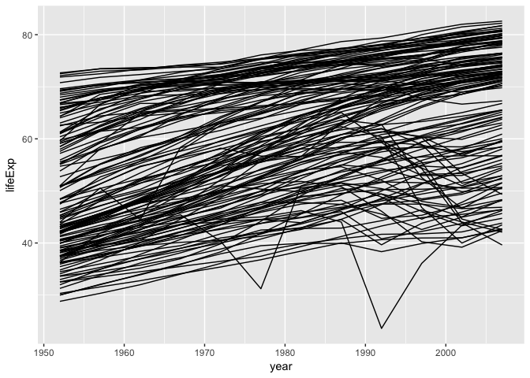
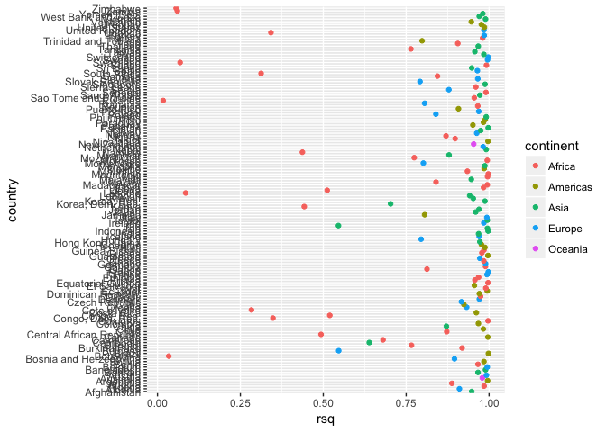
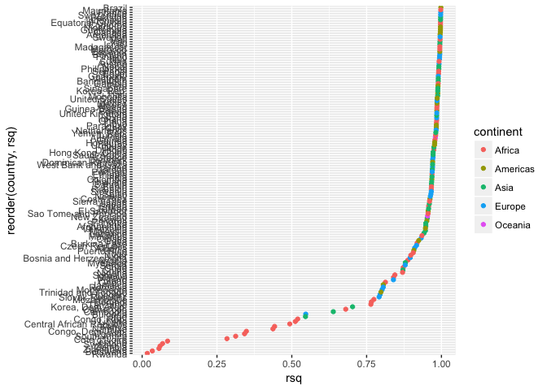
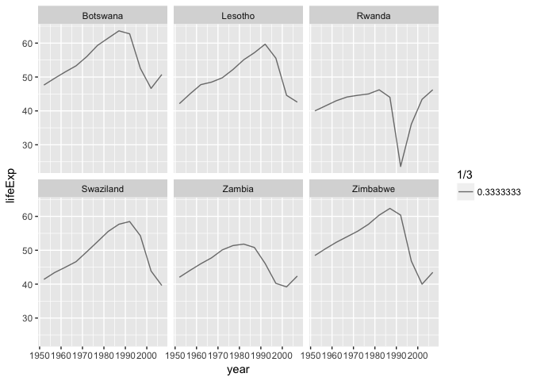
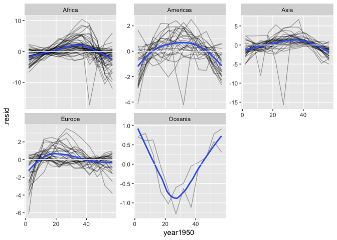

Gapminder for VHS 1/2017
================
Uwe Sterr
April 2017

-   [Finding AIDS impact in r square](#finding-aids-impact-in-r-square)
    -   [Peek into data](#peek-into-data)
        -   [Plot data](#plot-data)
        -   [Data wrangling](#data-wrangling)
        -   [Structure of dataframe](#structure-of-dataframe)
    -   [Build a model](#build-a-model)
        -   [Combine data wrangling and model building](#combine-data-wrangling-and-model-building)
    -   [Get the model data in a tidy form using the **broom** package](#get-the-model-data-in-a-tidy-form-using-the-broom-package)
        -   [Investigate how well the model fits](#investigate-how-well-the-model-fits)
        -   [Find the countries with the worst fit](#find-the-countries-with-the-worst-fit)
-   [How much did the countries improve life expectancy over time](#how-much-did-the-countries-improve-life-expectancy-over-time)

Finding AIDS impact in r square
===============================

Finding information in data using statistical characteristics **R-squared** is a statistical measure of how close the data are to the fitted regression line

**Inspired by **

-   TED talk of **Hans Rosling**: Let my dataset change your mindset <https://www.ted.com/talks/hans_rosling_at_state#t-1176407>

-   **Hadley Wickham** Managing many models with R <https://www.youtube.com/watch?v=rz3_FDVt9eg>

``` r
knitr::opts_chunk$set(cache=TRUE) # renders only changes => faster
library(gapminder)
library(tidyverse)
```

    ## Loading tidyverse: ggplot2
    ## Loading tidyverse: tibble
    ## Loading tidyverse: tidyr
    ## Loading tidyverse: readr
    ## Loading tidyverse: purrr
    ## Loading tidyverse: dplyr

    ## Conflicts with tidy packages ----------------------------------------------

    ## filter(): dplyr, stats
    ## lag():    dplyr, stats

``` r
tidyverse_packages()
```

    ##  [1] "broom"     "dplyr"     "forcats"   "ggplot2"   "haven"    
    ##  [6] "httr"      "hms"       "jsonlite"  "lubridate" "magrittr" 
    ## [11] "modelr"    "purrr"     "readr"     "readxl"    "stringr"  
    ## [16] "tibble"    "rvest"     "tidyr"     "xml2"      "tidyverse"

Peek into data
--------------

``` r
summary(gapminder)
```

    ##         country        continent        year         lifeExp     
    ##  Afghanistan:  12   Africa  :624   Min.   :1952   Min.   :23.60  
    ##  Albania    :  12   Americas:300   1st Qu.:1966   1st Qu.:48.20  
    ##  Algeria    :  12   Asia    :396   Median :1980   Median :60.71  
    ##  Angola     :  12   Europe  :360   Mean   :1980   Mean   :59.47  
    ##  Argentina  :  12   Oceania : 24   3rd Qu.:1993   3rd Qu.:70.85  
    ##  Australia  :  12                  Max.   :2007   Max.   :82.60  
    ##  (Other)    :1632                                                
    ##       pop              gdpPercap       
    ##  Min.   :6.001e+04   Min.   :   241.2  
    ##  1st Qu.:2.794e+06   1st Qu.:  1202.1  
    ##  Median :7.024e+06   Median :  3531.8  
    ##  Mean   :2.960e+07   Mean   :  7215.3  
    ##  3rd Qu.:1.959e+07   3rd Qu.:  9325.5  
    ##  Max.   :1.319e+09   Max.   :113523.1  
    ## 

``` r
gapminder %>% filter(gdpPercap < 300)
```

    ## # A tibble: 4 × 6
    ##            country continent  year lifeExp      pop gdpPercap
    ##             <fctr>    <fctr> <int>   <dbl>    <int>     <dbl>
    ## 1 Congo, Dem. Rep.    Africa  2002  44.966 55379852  241.1659
    ## 2 Congo, Dem. Rep.    Africa  2007  46.462 64606759  277.5519
    ## 3    Guinea-Bissau    Africa  1952  32.500   580653  299.8503
    ## 4          Lesotho    Africa  1952  42.138   748747  298.8462

### Plot data

``` r
# Print xy plot -----------------------------------------------------------
gapminder <- gapminder %>% mutate(year1950 = year -1950)
ggplot(gapminder, aes(x=year, y=lifeExp)) +geom_line(aes(group = country))
```



### Data wrangling

lets transform the data so that we keep all of a country's data in one row

-   build nested data.frame
-   access elements of nested data.frame

``` r
# Nested data -------------------------------------------------------------

by_country <- gapminder  %>%
  group_by(continent, country) %>%
  nest()

by_country                  # show content of df
```

    ## # A tibble: 142 × 3
    ##    continent     country              data
    ##       <fctr>      <fctr>            <list>
    ## 1       Asia Afghanistan <tibble [12 × 5]>
    ## 2     Europe     Albania <tibble [12 × 5]>
    ## 3     Africa     Algeria <tibble [12 × 5]>
    ## 4     Africa      Angola <tibble [12 × 5]>
    ## 5   Americas   Argentina <tibble [12 × 5]>
    ## 6    Oceania   Australia <tibble [12 × 5]>
    ## 7     Europe     Austria <tibble [12 × 5]>
    ## 8       Asia     Bahrain <tibble [12 × 5]>
    ## 9       Asia  Bangladesh <tibble [12 × 5]>
    ## 10    Europe     Belgium <tibble [12 × 5]>
    ## # ... with 132 more rows

``` r
str(by_country[1:3,])       # show structure of first 3 rows of grouped and nested df
```

    ## Classes 'tbl_df', 'tbl' and 'data.frame':    3 obs. of  3 variables:
    ##  $ continent: Factor w/ 5 levels "Africa","Americas",..: 3 4 1
    ##  $ country  : Factor w/ 142 levels "Afghanistan",..: 1 2 3
    ##  $ data     :List of 3
    ##   ..$ :Classes 'tbl_df', 'tbl' and 'data.frame': 12 obs. of  5 variables:
    ##   .. ..$ year     : int  1952 1957 1962 1967 1972 1977 1982 1987 1992 1997 ...
    ##   .. ..$ lifeExp  : num  28.8 30.3 32 34 36.1 ...
    ##   .. ..$ pop      : int  8425333 9240934 10267083 11537966 13079460 14880372 12881816 13867957 16317921 22227415 ...
    ##   .. ..$ gdpPercap: num  779 821 853 836 740 ...
    ##   .. ..$ year1950 : num  2 7 12 17 22 27 32 37 42 47 ...
    ##   ..$ :Classes 'tbl_df', 'tbl' and 'data.frame': 12 obs. of  5 variables:
    ##   .. ..$ year     : int  1952 1957 1962 1967 1972 1977 1982 1987 1992 1997 ...
    ##   .. ..$ lifeExp  : num  55.2 59.3 64.8 66.2 67.7 ...
    ##   .. ..$ pop      : int  1282697 1476505 1728137 1984060 2263554 2509048 2780097 3075321 3326498 3428038 ...
    ##   .. ..$ gdpPercap: num  1601 1942 2313 2760 3313 ...
    ##   .. ..$ year1950 : num  2 7 12 17 22 27 32 37 42 47 ...
    ##   ..$ :Classes 'tbl_df', 'tbl' and 'data.frame': 12 obs. of  5 variables:
    ##   .. ..$ year     : int  1952 1957 1962 1967 1972 1977 1982 1987 1992 1997 ...
    ##   .. ..$ lifeExp  : num  43.1 45.7 48.3 51.4 54.5 ...
    ##   .. ..$ pop      : int  9279525 10270856 11000948 12760499 14760787 17152804 20033753 23254956 26298373 29072015 ...
    ##   .. ..$ gdpPercap: num  2449 3014 2551 3247 4183 ...
    ##   .. ..$ year1950 : num  2 7 12 17 22 27 32 37 42 47 ...

``` r
by_country$data[[1]]        # show data of first row
```

    ## # A tibble: 12 × 5
    ##     year lifeExp      pop gdpPercap year1950
    ##    <int>   <dbl>    <int>     <dbl>    <dbl>
    ## 1   1952  28.801  8425333  779.4453        2
    ## 2   1957  30.332  9240934  820.8530        7
    ## 3   1962  31.997 10267083  853.1007       12
    ## 4   1967  34.020 11537966  836.1971       17
    ## 5   1972  36.088 13079460  739.9811       22
    ## 6   1977  38.438 14880372  786.1134       27
    ## 7   1982  39.854 12881816  978.0114       32
    ## 8   1987  40.822 13867957  852.3959       37
    ## 9   1992  41.674 16317921  649.3414       42
    ## 10  1997  41.763 22227415  635.3414       47
    ## 11  2002  42.129 25268405  726.7341       52
    ## 12  2007  43.828 31889923  974.5803       57

``` r
by_country$data[1]          # show data of first row
```

    ## [[1]]
    ## # A tibble: 12 × 5
    ##     year lifeExp      pop gdpPercap year1950
    ##    <int>   <dbl>    <int>     <dbl>    <dbl>
    ## 1   1952  28.801  8425333  779.4453        2
    ## 2   1957  30.332  9240934  820.8530        7
    ## 3   1962  31.997 10267083  853.1007       12
    ## 4   1967  34.020 11537966  836.1971       17
    ## 5   1972  36.088 13079460  739.9811       22
    ## 6   1977  38.438 14880372  786.1134       27
    ## 7   1982  39.854 12881816  978.0114       32
    ## 8   1987  40.822 13867957  852.3959       37
    ## 9   1992  41.674 16317921  649.3414       42
    ## 10  1997  41.763 22227415  635.3414       47
    ## 11  2002  42.129 25268405  726.7341       52
    ## 12  2007  43.828 31889923  974.5803       57

``` r
by_country$data[[1]][[2]]   # show  contents of second column 
```

    ##  [1] 28.801 30.332 31.997 34.020 36.088 38.438 39.854 40.822 41.674 41.763
    ## [11] 42.129 43.828

``` r
by_country$data[[1]][2]     # show second column
```

    ## # A tibble: 12 × 1
    ##    lifeExp
    ##      <dbl>
    ## 1   28.801
    ## 2   30.332
    ## 3   31.997
    ## 4   34.020
    ## 5   36.088
    ## 6   38.438
    ## 7   39.854
    ## 8   40.822
    ## 9   41.674
    ## 10  41.763
    ## 11  42.129
    ## 12  43.828

-   \[ returns a list
-   \[\[ returns content of list

a good explanation can be found at: <http://r4ds.had.co.nz/vectors.html#lists>

### Structure of dataframe

The column **data** is a list of data frames. Therefore, we have now a row per country and all data of that country in a dataframe in **one** column.

In a grouped dataframe **each row is an oberservation**, in a nested dataframe **each row is a group**, in this case, a group of a country’s observations.

Build a model
-------------

Lets build a model for each country, lifeExp ~ year

``` r
# Fit models --------------------------------------------------------------

country_model <- function(df){
  lm(lifeExp  ~  year1950, data=df)  # use year1950 because the absolute value is not important
}
models <- by_country %>%
  mutate(
    model = map(data, country_model)
  )
models
```

    ## # A tibble: 142 × 4
    ##    continent     country              data    model
    ##       <fctr>      <fctr>            <list>   <list>
    ## 1       Asia Afghanistan <tibble [12 × 5]> <S3: lm>
    ## 2     Europe     Albania <tibble [12 × 5]> <S3: lm>
    ## 3     Africa     Algeria <tibble [12 × 5]> <S3: lm>
    ## 4     Africa      Angola <tibble [12 × 5]> <S3: lm>
    ## 5   Americas   Argentina <tibble [12 × 5]> <S3: lm>
    ## 6    Oceania   Australia <tibble [12 × 5]> <S3: lm>
    ## 7     Europe     Austria <tibble [12 × 5]> <S3: lm>
    ## 8       Asia     Bahrain <tibble [12 × 5]> <S3: lm>
    ## 9       Asia  Bangladesh <tibble [12 × 5]> <S3: lm>
    ## 10    Europe     Belgium <tibble [12 × 5]> <S3: lm>
    ## # ... with 132 more rows

``` r
lm(lifeExp  ~  year1950, data=by_country$data[[1]]) 
```

    ## 
    ## Call:
    ## lm(formula = lifeExp ~ year1950, data = by_country$data[[1]])
    ## 
    ## Coefficients:
    ## (Intercept)     year1950  
    ##     29.3566       0.2753

``` r
models$model[1]
```

    ## [[1]]
    ## 
    ## Call:
    ## lm(formula = lifeExp ~ year1950, data = df)
    ## 
    ## Coefficients:
    ## (Intercept)     year1950  
    ##     29.3566       0.2753

### Combine data wrangling and model building

``` r
# Put it all together -----------------------------------------------------

by_country <- gapminder  %>%
  group_by(continent, country) %>%
  nest() %>%  
  mutate(
    model = map(data, country_model)
  )

by_country
```

    ## # A tibble: 142 × 4
    ##    continent     country              data    model
    ##       <fctr>      <fctr>            <list>   <list>
    ## 1       Asia Afghanistan <tibble [12 × 5]> <S3: lm>
    ## 2     Europe     Albania <tibble [12 × 5]> <S3: lm>
    ## 3     Africa     Algeria <tibble [12 × 5]> <S3: lm>
    ## 4     Africa      Angola <tibble [12 × 5]> <S3: lm>
    ## 5   Americas   Argentina <tibble [12 × 5]> <S3: lm>
    ## 6    Oceania   Australia <tibble [12 × 5]> <S3: lm>
    ## 7     Europe     Austria <tibble [12 × 5]> <S3: lm>
    ## 8       Asia     Bahrain <tibble [12 × 5]> <S3: lm>
    ## 9       Asia  Bangladesh <tibble [12 × 5]> <S3: lm>
    ## 10    Europe     Belgium <tibble [12 × 5]> <S3: lm>
    ## # ... with 132 more rows

Get the model data in a tidy form using the **broom** package
-------------------------------------------------------------

``` r
models <- models %>%
  mutate(
    glance  = map(model, broom::glance),        # Construct a single row summary "glance" of a model
    rsq     = glance %>% map_dbl("r.squared"),  # note the pipe within mutate(...)
    tidy    = map(model, broom::tidy),          # Tidy the result of a test into a summary data.frame
    augment = map(model, broom::augment)        # add columns to the original dataset such as predictions, residuals and cluster assignments
  ) 
models
```

    ## # A tibble: 142 × 8
    ##    continent     country              data    model                glance
    ##       <fctr>      <fctr>            <list>   <list>                <list>
    ## 1       Asia Afghanistan <tibble [12 × 5]> <S3: lm> <data.frame [1 × 11]>
    ## 2     Europe     Albania <tibble [12 × 5]> <S3: lm> <data.frame [1 × 11]>
    ## 3     Africa     Algeria <tibble [12 × 5]> <S3: lm> <data.frame [1 × 11]>
    ## 4     Africa      Angola <tibble [12 × 5]> <S3: lm> <data.frame [1 × 11]>
    ## 5   Americas   Argentina <tibble [12 × 5]> <S3: lm> <data.frame [1 × 11]>
    ## 6    Oceania   Australia <tibble [12 × 5]> <S3: lm> <data.frame [1 × 11]>
    ## 7     Europe     Austria <tibble [12 × 5]> <S3: lm> <data.frame [1 × 11]>
    ## 8       Asia     Bahrain <tibble [12 × 5]> <S3: lm> <data.frame [1 × 11]>
    ## 9       Asia  Bangladesh <tibble [12 × 5]> <S3: lm> <data.frame [1 × 11]>
    ## 10    Europe     Belgium <tibble [12 × 5]> <S3: lm> <data.frame [1 × 11]>
    ## # ... with 132 more rows, and 3 more variables: rsq <dbl>, tidy <list>,
    ## #   augment <list>

``` r
models$glance[1]
```

    ## [[1]]
    ##   r.squared adj.r.squared    sigma statistic      p.value df    logLik
    ## 1 0.9477123     0.9424835 1.222788  181.2494 9.835213e-08  2 -18.34693
    ##        AIC      BIC deviance df.residual
    ## 1 42.69387 44.14859  14.9521          10

``` r
models$rsq[1]
```

    ## [1] 0.9477123

``` r
models$tidy[1]
```

    ## [[1]]
    ##          term   estimate  std.error statistic      p.value
    ## 1 (Intercept) 29.3566375 0.69898128  41.99918 1.404235e-12
    ## 2    year1950  0.2753287 0.02045093  13.46289 9.835213e-08

``` r
models$augment[1]
```

    ## [[1]]
    ##    lifeExp year1950  .fitted   .se.fit      .resid       .hat   .sigma
    ## 1   28.801        2 29.90729 0.6639995 -1.10629487 0.29487179 1.211813
    ## 2   30.332        7 31.28394 0.5799442 -0.95193823 0.22494172 1.237512
    ## 3   31.997       12 32.66058 0.5026799 -0.66358159 0.16899767 1.265886
    ## 4   34.020       17 34.03722 0.4358337 -0.01722494 0.12703963 1.288917
    ## 5   36.088       22 35.41387 0.3848726  0.67413170 0.09906760 1.267003
    ## 6   38.438       27 36.79051 0.3566719  1.64748834 0.08508159 1.154002
    ## 7   39.854       32 38.16716 0.3566719  1.68684499 0.08508159 1.147076
    ## 8   40.822       37 39.54380 0.3848726  1.27820163 0.09906760 1.208243
    ## 9   41.674       42 40.92044 0.4358337  0.75355828 0.12703963 1.260583
    ## 10  41.763       47 42.29709 0.5026799 -0.53408508 0.16899767 1.274051
    ## 11  42.129       52 43.67373 0.5799442 -1.54472844 0.22494172 1.148593
    ## 12  43.828       57 45.05037 0.6639995 -1.22237179 0.29487179 1.194109
    ##         .cooksd  .std.resid
    ## 1  2.427205e-01 -1.07742164
    ## 2  1.134714e-01 -0.88428127
    ## 3  3.603567e-02 -0.59530844
    ## 4  1.653992e-05 -0.01507681
    ## 5  1.854831e-02  0.58082792
    ## 6  9.225358e-02  1.40857509
    ## 7  9.671389e-02  1.44222437
    ## 8  6.668277e-02  1.10129103
    ## 9  3.165567e-02  0.65958143
    ## 10 2.334344e-02 -0.47913530
    ## 11 2.987950e-01 -1.43494020
    ## 12 2.963271e-01 -1.19046907

### Investigate how well the model fits

``` r
models %>% 
  ggplot(aes(rsq, country)) +
  geom_point(aes(colour = continent)) 
```



``` r
# source("gapminderShiny.R")
```

is the plot clear? how could it be improved?

ggplot orders categorical variables alphabetically

``` r
models %>% 
  ggplot(aes(rsq, reorder(country, rsq))) +
  geom_point(aes(colour = continent)) 
```



### Find the countries with the worst fit

``` r
  models %>% filter((rsq<0.1 & rsq>0))  %>% unnest(rsq)  %>% top_n(6,rsq) %>% unnest(data) %>% 
    ggplot(aes(year, lifeExp)) +
    geom_line(aes( alpha = 1/3))  +
    facet_wrap(~country)
```



How much did the countries improve life expectancy over time
============================================================

``` r
library(plotly)
# Unnest data -------------------------------------------------------------

unnest(models, data)
```

    ## # A tibble: 1,704 × 8
    ##    continent     country       rsq  year lifeExp      pop gdpPercap
    ##       <fctr>      <fctr>     <dbl> <int>   <dbl>    <int>     <dbl>
    ## 1       Asia Afghanistan 0.9477123  1952  28.801  8425333  779.4453
    ## 2       Asia Afghanistan 0.9477123  1957  30.332  9240934  820.8530
    ## 3       Asia Afghanistan 0.9477123  1962  31.997 10267083  853.1007
    ## 4       Asia Afghanistan 0.9477123  1967  34.020 11537966  836.1971
    ## 5       Asia Afghanistan 0.9477123  1972  36.088 13079460  739.9811
    ## 6       Asia Afghanistan 0.9477123  1977  38.438 14880372  786.1134
    ## 7       Asia Afghanistan 0.9477123  1982  39.854 12881816  978.0114
    ## 8       Asia Afghanistan 0.9477123  1987  40.822 13867957  852.3959
    ## 9       Asia Afghanistan 0.9477123  1992  41.674 16317921  649.3414
    ## 10      Asia Afghanistan 0.9477123  1997  41.763 22227415  635.3414
    ## # ... with 1,694 more rows, and 1 more variables: year1950 <dbl>

``` r
unnest(models, glance, .drop = TRUE) 
```

    ## # A tibble: 142 × 14
    ##    continent     country       rsq r.squared adj.r.squared     sigma
    ##       <fctr>      <fctr>     <dbl>     <dbl>         <dbl>     <dbl>
    ## 1       Asia Afghanistan 0.9477123 0.9477123     0.9424835 1.2227880
    ## 2     Europe     Albania 0.9105778 0.9105778     0.9016355 1.9830615
    ## 3     Africa     Algeria 0.9851172 0.9851172     0.9836289 1.3230064
    ## 4     Africa      Angola 0.8878146 0.8878146     0.8765961 1.4070091
    ## 5   Americas   Argentina 0.9955681 0.9955681     0.9951249 0.2923072
    ## 6    Oceania   Australia 0.9796477 0.9796477     0.9776125 0.6206086
    ## 7     Europe     Austria 0.9921340 0.9921340     0.9913474 0.4074094
    ## 8       Asia     Bahrain 0.9667398 0.9667398     0.9634138 1.6395865
    ## 9       Asia  Bangladesh 0.9893609 0.9893609     0.9882970 0.9766908
    ## 10    Europe     Belgium 0.9945406 0.9945406     0.9939946 0.2929025
    ## # ... with 132 more rows, and 8 more variables: statistic <dbl>,
    ## #   p.value <dbl>, df <int>, logLik <dbl>, AIC <dbl>, BIC <dbl>,
    ## #   deviance <dbl>, df.residual <int>

``` r
unnest(models, tidy)
```

    ## # A tibble: 284 × 8
    ##    continent     country       rsq        term   estimate   std.error
    ##       <fctr>      <fctr>     <dbl>       <chr>      <dbl>       <dbl>
    ## 1       Asia Afghanistan 0.9477123 (Intercept) 29.3566375 0.698981278
    ## 2       Asia Afghanistan 0.9477123    year1950  0.2753287 0.020450934
    ## 3     Europe     Albania 0.9105778 (Intercept) 58.5597618 1.133575812
    ## 4     Europe     Albania 0.9105778    year1950  0.3346832 0.033166387
    ## 5     Africa     Algeria 0.9851172 (Intercept) 42.2364149 0.756269040
    ## 6     Africa     Algeria 0.9851172    year1950  0.5692797 0.022127070
    ## 7     Africa      Angola 0.8878146 (Intercept) 31.7079741 0.804287463
    ## 8     Africa      Angola 0.8878146    year1950  0.2093399 0.023532003
    ## 9   Americas   Argentina 0.9955681 (Intercept) 62.2250191 0.167091314
    ## 10  Americas   Argentina 0.9955681    year1950  0.2317084 0.004888791
    ## # ... with 274 more rows, and 2 more variables: statistic <dbl>,
    ## #   p.value <dbl>

``` r
# Plot data frame ---------------------------------------------------------


plotLife <- models %>%
  unnest(tidy) %>%
  select(continent, country, term, estimate, rsq) %>%
  spread(term, estimate) %>%
  ggplot(aes(`(Intercept)`,year1950))+
  geom_point(aes(colour = continent, size = rsq, fill = country)) +
  geom_smooth(se=FALSE) +
  xlab("Life expectancy (1950)") +
  ylab("Yearly improvement") +
  scale_size_area() + guides(fill=FALSE)
ggplotly(plotLife, tooltip = c("year1950", "country"))
```

preserve06cdb3471e934de6 \#\# where are the exeptions

``` r
unnest(models, augment) # using the unnest with one augment argument keeps the grouping variables and augment 
```

    ## # A tibble: 1,704 × 12
    ##    continent     country       rsq lifeExp year1950  .fitted   .se.fit
    ##       <fctr>      <fctr>     <dbl>   <dbl>    <dbl>    <dbl>     <dbl>
    ## 1       Asia Afghanistan 0.9477123  28.801        2 29.90729 0.6639995
    ## 2       Asia Afghanistan 0.9477123  30.332        7 31.28394 0.5799442
    ## 3       Asia Afghanistan 0.9477123  31.997       12 32.66058 0.5026799
    ## 4       Asia Afghanistan 0.9477123  34.020       17 34.03722 0.4358337
    ## 5       Asia Afghanistan 0.9477123  36.088       22 35.41387 0.3848726
    ## 6       Asia Afghanistan 0.9477123  38.438       27 36.79051 0.3566719
    ## 7       Asia Afghanistan 0.9477123  39.854       32 38.16716 0.3566719
    ## 8       Asia Afghanistan 0.9477123  40.822       37 39.54380 0.3848726
    ## 9       Asia Afghanistan 0.9477123  41.674       42 40.92044 0.4358337
    ## 10      Asia Afghanistan 0.9477123  41.763       47 42.29709 0.5026799
    ## # ... with 1,694 more rows, and 5 more variables: .resid <dbl>,
    ## #   .hat <dbl>, .sigma <dbl>, .cooksd <dbl>, .std.resid <dbl>

``` r
models %>% unnest(augment) %>% 
  ggplot(aes(year1950, .resid)) +
  geom_line(aes(group = country), alpha = 1/3) +
  geom_smooth(se = FALSE) +
  geom_hline(yintercept = 0, colour = "white") +
  facet_wrap(~continent, scales = "free_y") 
```

    ## `geom_smooth()` using method = 'loess'



Add a new chunk by clicking the *Insert Chunk* button on the toolbar or by pressing *Cmd+Option+I*.

When you save the notebook, an HTML file containing the code and output will be saved alongside it (click the *Preview* button or press *Cmd+Shift+K* to preview the HTML file).
