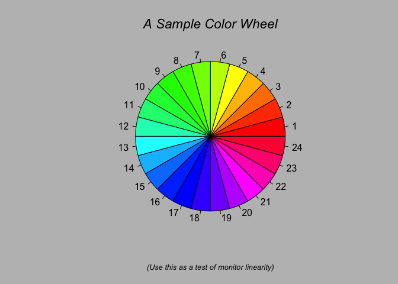
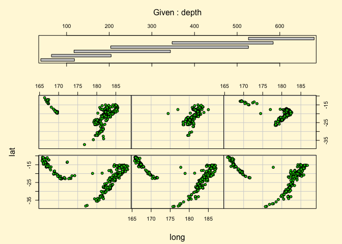
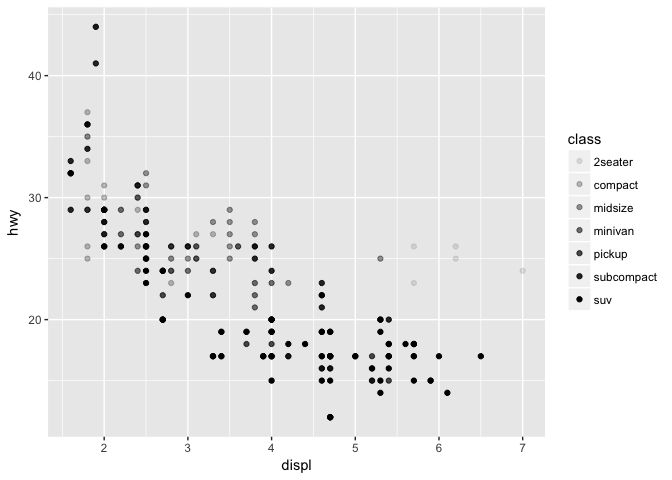
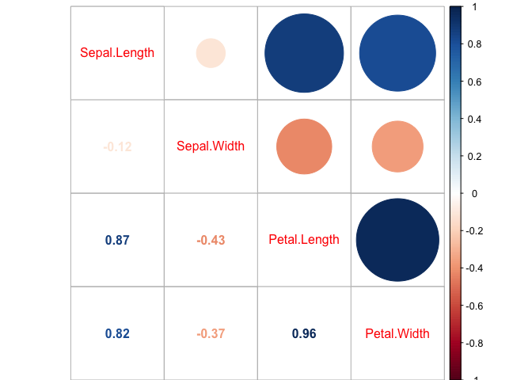
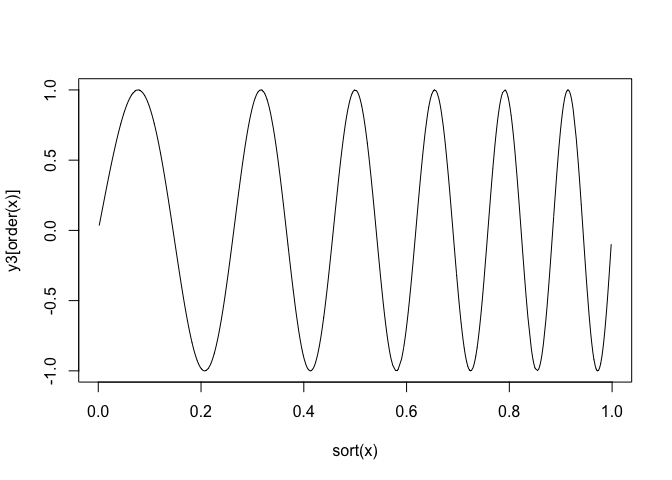
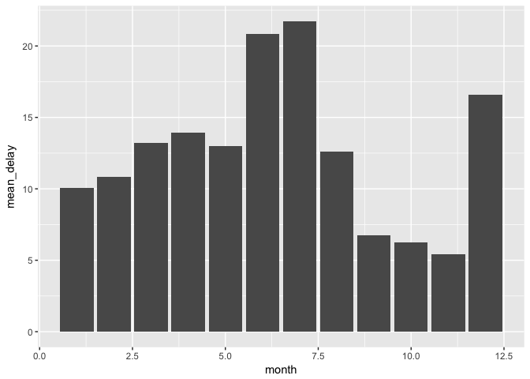
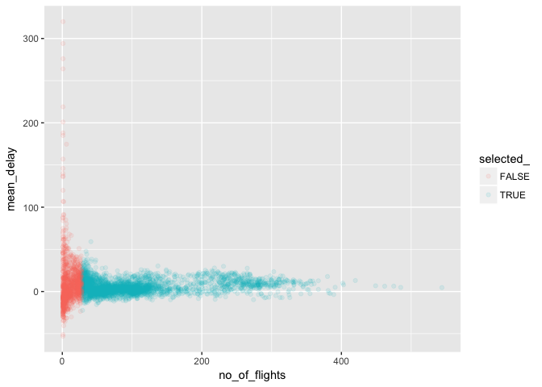
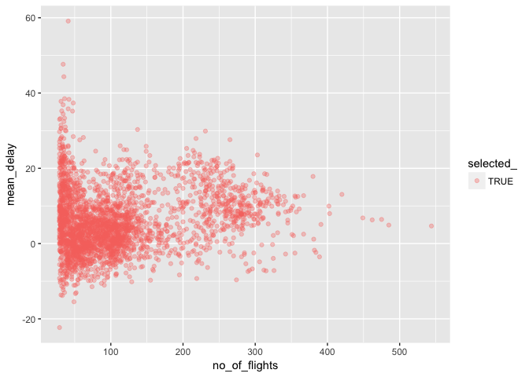

R Kenntnisse VHS 1\_2017
================
Uwe Sterr
April 2017

-   [Data visualisation](#data-visualisation)
    -   [Where can I find useful packages?](#where-can-i-find-useful-packages)
    -   [Where can I find how to use packages](#where-can-i-find-how-to-use-packages)
    -   [Analyse data](#analyse-data)
    -   [Creating a ggplot](#creating-a-ggplot)
        -   [Create a ggplot with color = class](#create-a-ggplot-with-color-class)
        -   [Create a ggplot with size = cty](#create-a-ggplot-with-size-cty)
        -   [Create a ggplot with alpha = class](#create-a-ggplot-with-alpha-class)
        -   [Create a ggplot with shape = class](#create-a-ggplot-with-shape-class)
        -   [Create plot where property of geom is set manually](#create-plot-where-property-of-geom-is-set-manually)
    -   [Recap](#recap)
    -   [Facets](#facets)
        -   [facet\_wrap](#facet_wrap)
        -   [facet\_grid](#facet_grid)
    -   [Geometic objects](#geometic-objects)
        -   [geom\_smooth with more than one line](#geom_smooth-with-more-than-one-line)
        -   [display several geoms in same plot](#display-several-geoms-in-same-plot)
        -   [don't repeat code](#dont-repeat-code)
        -   [use only subset of data for geom](#use-only-subset-of-data-for-geom)
        -   [bar plot for discrete x-data](#bar-plot-for-discrete-x-data)
        -   [lost in all the options?](#lost-in-all-the-options)
-   [Statistical transformations](#statistical-transformations)
    -   [box plot for discrete x- and continuous y-data](#box-plot-for-discrete-x--and-continuous-y-data)
    -   [Violin plot for discrete x- and continuous y-data](#violin-plot-for-discrete-x--and-continuous-y-data)
    -   [Histogram](#histogram)
    -   [use geom\_freqpoly for easier comparison](#use-geom_freqpoly-for-easier-comparison)
    -   [Empirical Cumulative Distribution Function (ECDF)](#empirical-cumulative-distribution-function-ecdf)
    -   [Find correlations](#find-correlations)
    -   [Maximal Information Coefficient (MIC)](#maximal-information-coefficient-mic)
    -   [Recap](#recap-1)
        -   [Now get your hands dirty on: facets, geom\_ ...](#now-get-your-hands-dirty-on-facets-geom_-...)
-   [Data wrangling](#data-wrangling)
    -   [filter rows](#filter-rows)
    -   [store all x-mas flights](#store-all-x-mas-flights)
    -   [boolean operators work as well](#boolean-operators-work-as-well)
    -   [Arrange rows with arrange()](#arrange-rows-with-arrange)
    -   [select columns with select()](#select-columns-with-select)
    -   [Add new variables with mutate()](#add-new-variables-with-mutate)
    -   [Grouped summaries with summarise()](#grouped-summaries-with-summarise)
    -   [Find planes with high delays](#find-planes-with-high-delays)
        -   [Now get your hands dirty on select, summarise, mutate...](#now-get-your-hands-dirty-on-select-summarise-mutate...)
-   [Now a few more things we need for the EuropeLeagueTransfers.Rmd](#now-a-few-more-things-we-need-for-the-europeleaguetransfers.rmd)
    -   [left\_join](#left_join)
    -   [find the links between the data.frames](#find-the-links-between-the-data.frames)
    -   [lets find out which manufacturer has the highest delays](#lets-find-out-which-manufacturer-has-the-highest-delays)
    -   [lets find out which airline has the highest delays](#lets-find-out-which-airline-has-the-highest-delays)
    -   [long and wide data.frames](#long-and-wide-data.frames)
    -   [last thing we need for EuropeLeagueTransfers.Rmd](#last-thing-we-need-for-europeleaguetransfers.rmd)
-   [Lets dive into some code](#lets-dive-into-some-code)

This is an [R Markdown](http://rmarkdown.rstudio.com) Notebook. When you execute code within the notebook, the results appear beneath the code.

Try executing this chunk by clicking the *Run* button within the chunk or by placing your cursor inside it and pressing *Cmd+Shift+Enter*.

Data visualisation
==================

``` r
library(tidyverse)
```

    ## Loading tidyverse: ggplot2
    ## Loading tidyverse: tibble
    ## Loading tidyverse: tidyr
    ## Loading tidyverse: readr
    ## Loading tidyverse: purrr
    ## Loading tidyverse: dplyr

    ## Conflicts with tidy packages ----------------------------------------------

    ## filter(): dplyr, stats
    ## lag():    dplyr, stats

``` r
tidyverse_packages()  # which packages are in tidyverse
```

    ##  [1] "broom"     "dplyr"     "forcats"   "ggplot2"   "haven"    
    ##  [6] "httr"      "hms"       "jsonlite"  "lubridate" "magrittr" 
    ## [11] "modelr"    "purrr"     "readr"     "readxl"    "stringr"  
    ## [16] "tibble"    "rvest"     "tidyr"     "xml2"      "tidyverse"

``` r
knitr::opts_chunk$set(cache=TRUE) # renders only changes => faster
```

Where can I find useful packages?
---------------------------------

-   CRAN "task views" <https://cran.r-project.org>
-   r-bloggers search <http://www.r-bloggers.com>

Where can I find how to use packages
------------------------------------

-   Reference manual on CRAN
-   Vignettes
-   ?
-   Demos

``` r
# List vignettes from all *attached* packages
vignette(all = FALSE)
# List vignettes from all *installed* packages (can take a long time!):
vignette(all = TRUE)
# find vignettes of "ggplot2"
vignette(package = "ggplot2")
# view vignette "ggplot2-specs"  
vignette("ggplot2-specs")
```

    ## starting httpd help server ...

    ##  done

now look for more information on ggplot

``` r
?ggplot2
demo()          # find demos for attached packages
demo(graphics)  # A show of some of R's graphics capabilities, run in console
```

    ## 
    ## 
    ##  demo(graphics)
    ##  ---- ~~~~~~~~
    ## 
    ## > #  Copyright (C) 1997-2009 The R Core Team
    ## > 
    ## > require(datasets)
    ## 
    ## > require(grDevices); require(graphics)
    ## 
    ## > ## Here is some code which illustrates some of the differences between
    ## > ## R and S graphics capabilities.  Note that colors are generally specified
    ## > ## by a character string name (taken from the X11 rgb.txt file) and that line
    ## > ## textures are given similarly.  The parameter "bg" sets the background
    ## > ## parameter for the plot and there is also an "fg" parameter which sets
    ## > ## the foreground color.
    ## > 
    ## > 
    ## > x <- stats::rnorm(50)
    ## 
    ## > opar <- par(bg = "white")
    ## 
    ## > plot(x, ann = FALSE, type = "n")


    ## 
    ## > abline(h = 0, col = gray(.90))
    ## 
    ## > lines(x, col = "green4", lty = "dotted")
    ## 
    ## > points(x, bg = "limegreen", pch = 21)
    ## 
    ## > title(main = "Simple Use of Color In a Plot",
    ## +       xlab = "Just a Whisper of a Label",
    ## +       col.main = "blue", col.lab = gray(.8),
    ## +       cex.main = 1.2, cex.lab = 1.0, font.main = 4, font.lab = 3)
    ## 
    ## > ## A little color wheel.    This code just plots equally spaced hues in
    ## > ## a pie chart.    If you have a cheap SVGA monitor (like me) you will
    ## > ## probably find that numerically equispaced does not mean visually
    ## > ## equispaced.  On my display at home, these colors tend to cluster at
    ## > ## the RGB primaries.  On the other hand on the SGI Indy at work the
    ## > ## effect is near perfect.
    ## > 
    ## > par(bg = "gray")
    ## 
    ## > pie(rep(1,24), col = rainbow(24), radius = 0.9)



    ## 
    ## > title(main = "A Sample Color Wheel", cex.main = 1.4, font.main = 3)
    ## 
    ## > title(xlab = "(Use this as a test of monitor linearity)",
    ## +       cex.lab = 0.8, font.lab = 3)
    ## 
    ## > ## We have already confessed to having these.  This is just showing off X11
    ## > ## color names (and the example (from the postscript manual) is pretty "cute".
    ## > 
    ## > pie.sales <- c(0.12, 0.3, 0.26, 0.16, 0.04, 0.12)
    ## 
    ## > names(pie.sales) <- c("Blueberry", "Cherry",
    ## +              "Apple", "Boston Cream", "Other", "Vanilla Cream")
    ## 
    ## > pie(pie.sales,
    ## +     col = c("purple","violetred1","green3","cornsilk","cyan","white"))


    ## 
    ## > title(main = "January Pie Sales", cex.main = 1.8, font.main = 1)
    ## 
    ## > title(xlab = "(Don't try this at home kids)", cex.lab = 0.8, font.lab = 3)
    ## 
    ## > ## Boxplots:  I couldn't resist the capability for filling the "box".
    ## > ## The use of color seems like a useful addition, it focuses attention
    ## > ## on the central bulk of the data.
    ## > 
    ## > par(bg="cornsilk")
    ## 
    ## > n <- 10
    ## 
    ## > g <- gl(n, 100, n*100)
    ## 
    ## > x <- rnorm(n*100) + sqrt(as.numeric(g))
    ## 
    ## > boxplot(split(x,g), col="lavender", notch=TRUE)


    ## 
    ## > title(main="Notched Boxplots", xlab="Group", font.main=4, font.lab=1)
    ## 
    ## > ## An example showing how to fill between curves.
    ## > 
    ## > par(bg="white")
    ## 
    ## > n <- 100
    ## 
    ## > x <- c(0,cumsum(rnorm(n)))
    ## 
    ## > y <- c(0,cumsum(rnorm(n)))
    ## 
    ## > xx <- c(0:n, n:0)
    ## 
    ## > yy <- c(x, rev(y))
    ## 
    ## > plot(xx, yy, type="n", xlab="Time", ylab="Distance")


    ## 
    ## > polygon(xx, yy, col="gray")
    ## 
    ## > title("Distance Between Brownian Motions")
    ## 
    ## > ## Colored plot margins, axis labels and titles.    You do need to be
    ## > ## careful with these kinds of effects.    It's easy to go completely
    ## > ## over the top and you can end up with your lunch all over the keyboard.
    ## > ## On the other hand, my market research clients love it.
    ## > 
    ## > x <- c(0.00, 0.40, 0.86, 0.85, 0.69, 0.48, 0.54, 1.09, 1.11, 1.73, 2.05, 2.02)
    ## 
    ## > par(bg="lightgray")
    ## 
    ## > plot(x, type="n", axes=FALSE, ann=FALSE)


    ## 
    ## > usr <- par("usr")
    ## 
    ## > rect(usr[1], usr[3], usr[2], usr[4], col="cornsilk", border="black")
    ## 
    ## > lines(x, col="blue")
    ## 
    ## > points(x, pch=21, bg="lightcyan", cex=1.25)
    ## 
    ## > axis(2, col.axis="blue", las=1)
    ## 
    ## > axis(1, at=1:12, lab=month.abb, col.axis="blue")
    ## 
    ## > box()
    ## 
    ## > title(main= "The Level of Interest in R", font.main=4, col.main="red")
    ## 
    ## > title(xlab= "1996", col.lab="red")
    ## 
    ## > ## A filled histogram, showing how to change the font used for the
    ## > ## main title without changing the other annotation.
    ## > 
    ## > par(bg="cornsilk")
    ## 
    ## > x <- rnorm(1000)
    ## 
    ## > hist(x, xlim=range(-4, 4, x), col="lavender", main="")


    ## 
    ## > title(main="1000 Normal Random Variates", font.main=3)
    ## 
    ## > ## A scatterplot matrix
    ## > ## The good old Iris data (yet again)
    ## > 
    ## > pairs(iris[1:4], main="Edgar Anderson's Iris Data", font.main=4, pch=19)


    ## 
    ## > pairs(iris[1:4], main="Edgar Anderson's Iris Data", pch=21,
    ## +       bg = c("red", "green3", "blue")[unclass(iris$Species)])


    ## 
    ## > ## Contour plotting
    ## > ## This produces a topographic map of one of Auckland's many volcanic "peaks".
    ## > 
    ## > x <- 10*1:nrow(volcano)
    ## 
    ## > y <- 10*1:ncol(volcano)
    ## 
    ## > lev <- pretty(range(volcano), 10)
    ## 
    ## > par(bg = "lightcyan")
    ## 
    ## > pin <- par("pin")
    ## 
    ## > xdelta <- diff(range(x))
    ## 
    ## > ydelta <- diff(range(y))
    ## 
    ## > xscale <- pin[1]/xdelta
    ## 
    ## > yscale <- pin[2]/ydelta
    ## 
    ## > scale <- min(xscale, yscale)
    ## 
    ## > xadd <- 0.5*(pin[1]/scale - xdelta)
    ## 
    ## > yadd <- 0.5*(pin[2]/scale - ydelta)
    ## 
    ## > plot(numeric(0), numeric(0),
    ## +      xlim = range(x)+c(-1,1)*xadd, ylim = range(y)+c(-1,1)*yadd,
    ## +      type = "n", ann = FALSE)


    ## 
    ## > usr <- par("usr")
    ## 
    ## > rect(usr[1], usr[3], usr[2], usr[4], col="green3")
    ## 
    ## > contour(x, y, volcano, levels = lev, col="yellow", lty="solid", add=TRUE)
    ## 
    ## > box()
    ## 
    ## > title("A Topographic Map of Maunga Whau", font= 4)
    ## 
    ## > title(xlab = "Meters North", ylab = "Meters West", font= 3)
    ## 
    ## > mtext("10 Meter Contour Spacing", side=3, line=0.35, outer=FALSE,
    ## +       at = mean(par("usr")[1:2]), cex=0.7, font=3)
    ## 
    ## > ## Conditioning plots
    ## > 
    ## > par(bg="cornsilk")
    ## 
    ## > coplot(lat ~ long | depth, data = quakes, pch = 21, bg = "green3")



    ## 
    ## > par(opar)

Analyse data
------------

note that the pipe can be run in parts (short cut Ctrl+Shift+M, CMD+SHIFT+M )

``` r
View(mpg)
mpg  %>% select(displ, cty, hwy, year)  %>% plot()
# compare this to the "nested" version of the command sequence
plot(select(mpg,displ,cty,hwy,year))
```


Creating a ggplot
-----------------

"ggplot" is part of the "tidyverse" and a widely used package to work with graphics **note** for ggplot there is **"+"** to combine commands, in contrast to **"% &gt; %"** which is the pipe operator for commands outside ggplot

``` r
mpg %>% ggplot + 
  geom_point(mapping = aes(x = displ, y = hwy))
```


### Create a ggplot with color = class

``` r
mpg %>% ggplot +
  geom_point(mapping = aes(x = displ, y = hwy, color = class))
```


### Create a ggplot with size = cty

plot the size depending to miles per gallon in the city, lower values and therefore smaller points are better

``` r
mpg %>% ggplot +
  geom_point(mapping = aes(x = displ, y = hwy, size = cty))
```


### Create a ggplot with alpha = class

``` r
mpg %>% ggplot +
  geom_point(mapping = aes(x = displ, y = hwy, alpha = class))
```



### Create a ggplot with shape = class

**note** there are only 6 different shapes, therefore "suv" has no shape and is not displayed

``` r
mpg %>% ggplot +
  geom_point(mapping = aes(x = displ, y = hwy, shape = class))
```

    ## Warning: The shape palette can deal with a maximum of 6 discrete values
    ## because more than 6 becomes difficult to discriminate; you have 7.
    ## Consider specifying shapes manually if you must have them.

    ## Warning: Removed 62 rows containing missing values (geom_point).


### Create plot where property of geom is set manually

``` r
mpg %>% ggplot + 
  geom_point(mapping = aes(x = displ, y = hwy), color = "blue")
```


Recap
-----

-   Where would you check for packages?
-   Where would you look on how to use packages?
-   When would you use size as function of a variable in a plot?

Facets
------

If there is a variable value which separates data it can be used to create multiple plots rather than multiple lines in one plot.

### facet\_wrap

facet\_wrap wraps a 1d sequence of panels into 2d

``` r
mpg %>% ggplot +
  geom_point(mapping = aes(x = displ, y = hwy)) + 
  facet_wrap(~ class, nrow = 2)
```


### facet\_grid

facet\_grid forms a matrix of panels defined by row and column facetting variables.

``` r
mpg %>% ggplot +
  geom_point(mapping = aes(x = displ, y = hwy)) + 
  facet_grid(drv ~ cyl)
```


#### Now get your hands dirty on size, color, shape, alpha

Analyse available data set in ggplot2! The data sets are listed and explained @ <http://docs.ggplot2.org>

Use - size - color - alpha - shape

to emphasise you message

``` r
ggplot(midwest, aes(x= area, y = poptotal, color = percchildbelowpovert)) + geom_point() + facet_wrap(~ state, nrow = 3) + scale_y_log10() + scale_x_log10()
```


Geometic objects
----------------

different ways to present the same data

``` r
mpg %>% ggplot + 
  geom_point(mapping = aes(x = displ, y = hwy)) 
```


``` r
mpg %>% ggplot +
  geom_smooth(mapping = aes(x = displ, y = hwy))
```

    ## `geom_smooth()` using method = 'loess'


### geom\_smooth with more than one line

draw a different line, with a different linetype, for each unique value of the variable that you map to linetype

``` r
mpg %>% ggplot +
  geom_smooth(mapping = aes(x = displ, y = hwy, linetype = drv, color = drv))
```

    ## `geom_smooth()` using method = 'loess'


### display several geoms in same plot

``` r
mpg %>% ggplot +
  geom_point(mapping =  aes(x = displ, y = hwy)) +
  geom_smooth(mapping = aes(x = displ, y = hwy))
```

    ## `geom_smooth()` using method = 'loess'


### don't repeat code

``` r
mpg %>% ggplot(mapping = aes(x = displ, y = hwy)) + 
  geom_point(mapping = aes(color = class)) + 
  geom_smooth()
```

    ## `geom_smooth()` using method = 'loess'


### use only subset of data for geom

``` r
mpg %>% ggplot(mapping = aes(x = displ, y = hwy)) + 
geom_point(mapping = aes(color = class)) + 
  geom_smooth(data = mpg %>% filter(class == "subcompact"), se = FALSE)
```

    ## `geom_smooth()` using method = 'loess'


### bar plot for discrete x-data

``` r
diamonds %>% ggplot + 
  geom_bar(mapping = aes(x = cut))
```


### lost in all the options?

-   CHEAT SHEETS are at your fingertips under HELP menu of RStudio IDE or <https://www.rstudio.com/resources/cheatsheets/>

-   stackoverflow is a vivid community <http://stackoverflow.com>

-   RDocumentation searches CRAN, BioConductor and Github packages <https://www.rdocumentation.org>

Statistical transformations
===========================

box plot for discrete x- and continuous y-data
----------------------------------------------

``` r
diamonds %>% ggplot + 
  geom_boxplot(mapping = aes(x = cut, y = price))
```


Violin plot for discrete x- and continuous y-data
-------------------------------------------------

gives good impression of distribution

``` r
diamonds %>% ggplot +  
  geom_violin(mapping = aes(x = cut, y = price, color = cut))
```


Histogram
---------

A histogram is a graphical representation of the distribution of numerical data.

<https://de.wikipedia.org/wiki/Histogramm>

Definition of each column
$$n=\\sum \_{i=1}^{k}{m\_{i}}$$

``` r
diamonds %>% ggplot(aes(carat)) +
  geom_histogram()
```

    ## `stat_bin()` using `bins = 30`. Pick better value with `binwidth`.


``` r
# set binwidth
diamonds %>% ggplot(aes(carat)) +
  geom_histogram(binwidth = 0.1)
```


``` r
# set number of bins
diamonds %>% ggplot(aes(carat)) +
  geom_histogram(bins = 50)
```


use geom\_freqpoly for easier comparison
----------------------------------------

``` r
# Rather than stacking histograms, it's easier to compare frequency
# polygons
diamonds %>% ggplot(aes(price, fill = cut)) +
  geom_histogram(binwidth = 500)
```


``` r
diamonds %>% ggplot(aes(price, colour = cut)) +
  geom_freqpoly(binwidth = 500)
```


work with densities, means each curve has area of one

``` r
# To make it easier to compare distributions with very different counts,
# put density on the y axis instead of the default count
ggplot(diamonds, aes(price, ..density.., colour = cut)) +
  geom_freqpoly(binwidth = 500)
```


Empirical Cumulative Distribution Function (ECDF)
-------------------------------------------------

The fraction of samples **lower** then a threshold are given by the ECDF

The empirical distribution function estimates the cumulative distribution function underlying of the points in the sample and converges with probability 1.
*F*<sub>*X*</sub>(*x*)=*P*(*X* ≤ *x*)

<https://de.wikipedia.org/wiki/Empirische_Verteilungsfunktion>

``` r
df <- data.frame(x = rnorm(10000))
df %>% ggplot(aes(x)) + geom_histogram()
```

    ## `stat_bin()` using `bins = 30`. Pick better value with `binwidth`.


``` r
df %>% ggplot(aes(x)) + stat_ecdf(geom = "step")
```

 The fraction of samples **higher** then a threshold are given by the **CCDF**

$$\\bar{F}(x)={P} (X&gt;x)=1-F(x)$$

``` r
p  <- ggplot(df, aes(x)) + stat_ecdf()
pg <- ggplot_build(p)$data[[1]]
ggplot(pg, aes(x = x, y = 1-y )) + geom_step() + scale_y_log10() 
```

    ## Warning: Transformation introduced infinite values in continuous y-axis


Find correlations
-----------------

In statistics relationship between two variables.

$$\\rho \_{X,Y}=\\mathrm {corr} (X,Y)={\\mathrm {cov} (X,Y) \\over \\sigma \_{X}\\sigma \_{Y}}={E\[(X-\\mu \_{X})(Y-\\mu \_{Y})\] \\over \\sigma \_{X}\\sigma \_{Y}}$$

``` r
library(corrplot)
cor_iris <- iris %>% select(-Species) %>% cor()
corrplot.mixed(cor_iris)
```



``` r
corrplot(cor_iris, method="ellipse")
```


further details on the corrplot package can be found in the vignette

``` r
vignette("corrplot-intro")
```

Maximal Information Coefficient (MIC)
-------------------------------------

In statistics, the maximal information coefficient (MIC) is a measure of the strength of the **linear** or **non-linear** association between two variables X and Y.

``` r
library(minerva)
compare_mic_r = function(x, y){
cat( "MIC:", mine(x,y)$MIC, ";", "correlation: ", cor(x,y), "\n")  
}
x <- runif(n=1000, min=0, max=1)
y2 <- 4*(x-0.5)^2; plot(sort(x),y2[order(x)],type="l"); compare_mic_r(x,y2)
```


    ## MIC: 1 ; correlation:  -0.03810384

``` r
y3 <- sin(6*pi*x*(1+x)); plot(sort(x),y3[order(x)],type="l"); compare_mic_r(x,y3)
```



    ## MIC: 1 ; correlation:  -0.1584519

``` r
t <- seq(from=0,to=2*pi,length.out=1000)
x4 <- cos(t); y4 <- sin(t); plot(x4, y4, type="l",asp=1); compare_mic_r(x4,y4)
```


    ## MIC: 0.6829015 ; correlation:  5.798018e-18

Recap
-----

-   Which geom seems useful for you?
-   Any idea where could use facet plots for one of your tasks?
-   What do you think about correlation and maximum information coefficient?

#### Now get your hands dirty on: facets, geom\_ ...

Explore a data set even further use

use

-   facets
-   different geoms\_
-   geom\_bar
-   geom\_boxplot
-   geom\_histogram
-   geom\_freqpoly
-   stat\_ecdf
-   correlation
-   MIC

need help?

-   cheat sheets
-   docs of ggplot
-   <http://docs.ggplot2.org>

Data wrangling
==============

``` r
library(nycflights13)
flights
```

    ## # A tibble: 336,776 × 19
    ##     year month   day dep_time sched_dep_time dep_delay arr_time
    ##    <int> <int> <int>    <int>          <int>     <dbl>    <int>
    ## 1   2013     1     1      517            515         2      830
    ## 2   2013     1     1      533            529         4      850
    ## 3   2013     1     1      542            540         2      923
    ## 4   2013     1     1      544            545        -1     1004
    ## 5   2013     1     1      554            600        -6      812
    ## 6   2013     1     1      554            558        -4      740
    ## 7   2013     1     1      555            600        -5      913
    ## 8   2013     1     1      557            600        -3      709
    ## 9   2013     1     1      557            600        -3      838
    ## 10  2013     1     1      558            600        -2      753
    ## # ... with 336,766 more rows, and 12 more variables: sched_arr_time <int>,
    ## #   arr_delay <dbl>, carrier <chr>, flight <int>, tailnum <chr>,
    ## #   origin <chr>, dest <chr>, air_time <dbl>, distance <dbl>, hour <dbl>,
    ## #   minute <dbl>, time_hour <dttm>

filter rows
-----------

filter all rows where month == 1 and day == 1, multiple filter conditions are separated by "," and are treated as logical "AND"

``` r
flights %>% filter(month == 1, day == 1)
```

    ## # A tibble: 842 × 19
    ##     year month   day dep_time sched_dep_time dep_delay arr_time
    ##    <int> <int> <int>    <int>          <int>     <dbl>    <int>
    ## 1   2013     1     1      517            515         2      830
    ## 2   2013     1     1      533            529         4      850
    ## 3   2013     1     1      542            540         2      923
    ## 4   2013     1     1      544            545        -1     1004
    ## 5   2013     1     1      554            600        -6      812
    ## 6   2013     1     1      554            558        -4      740
    ## 7   2013     1     1      555            600        -5      913
    ## 8   2013     1     1      557            600        -3      709
    ## 9   2013     1     1      557            600        -3      838
    ## 10  2013     1     1      558            600        -2      753
    ## # ... with 832 more rows, and 12 more variables: sched_arr_time <int>,
    ## #   arr_delay <dbl>, carrier <chr>, flight <int>, tailnum <chr>,
    ## #   origin <chr>, dest <chr>, air_time <dbl>, distance <dbl>, hour <dbl>,
    ## #   minute <dbl>, time_hour <dttm>

``` r
?base::Logic
```

store all x-mas flights
-----------------------

note, if you wrap the expression in () then the result will be displayed even when the result is assigned to a variable.

The

``` r
(xmas_flights <- flights %>% filter( month == 12, day == 24))
```

    ## # A tibble: 761 × 19
    ##     year month   day dep_time sched_dep_time dep_delay arr_time
    ##    <int> <int> <int>    <int>          <int>     <dbl>    <int>
    ## 1   2013    12    24        9           2359        10      444
    ## 2   2013    12    24      458            500        -2      652
    ## 3   2013    12    24      513            515        -2      813
    ## 4   2013    12    24      543            540         3      844
    ## 5   2013    12    24      546            550        -4     1032
    ## 6   2013    12    24      555            600        -5      851
    ## 7   2013    12    24      556            600        -4      845
    ## 8   2013    12    24      557            600        -3      908
    ## 9   2013    12    24      558            600        -2      827
    ## 10  2013    12    24      558            600        -2      729
    ## # ... with 751 more rows, and 12 more variables: sched_arr_time <int>,
    ## #   arr_delay <dbl>, carrier <chr>, flight <int>, tailnum <chr>,
    ## #   origin <chr>, dest <chr>, air_time <dbl>, distance <dbl>, hour <dbl>,
    ## #   minute <dbl>, time_hour <dttm>

boolean operators work as well
------------------------------

``` r
flights %>% filter( month == 11 | month == 12)
```

    ## # A tibble: 55,403 × 19
    ##     year month   day dep_time sched_dep_time dep_delay arr_time
    ##    <int> <int> <int>    <int>          <int>     <dbl>    <int>
    ## 1   2013    11     1        5           2359         6      352
    ## 2   2013    11     1       35           2250       105      123
    ## 3   2013    11     1      455            500        -5      641
    ## 4   2013    11     1      539            545        -6      856
    ## 5   2013    11     1      542            545        -3      831
    ## 6   2013    11     1      549            600       -11      912
    ## 7   2013    11     1      550            600       -10      705
    ## 8   2013    11     1      554            600        -6      659
    ## 9   2013    11     1      554            600        -6      826
    ## 10  2013    11     1      554            600        -6      749
    ## # ... with 55,393 more rows, and 12 more variables: sched_arr_time <int>,
    ## #   arr_delay <dbl>, carrier <chr>, flight <int>, tailnum <chr>,
    ## #   origin <chr>, dest <chr>, air_time <dbl>, distance <dbl>, hour <dbl>,
    ## #   minute <dbl>, time_hour <dttm>

the following expressions give the same result

``` r
mpg %>% filter(cyl > 4, displ >2.8)
```

    ## # A tibble: 134 × 11
    ##    manufacturer              model displ  year   cyl      trans   drv
    ##           <chr>              <chr> <dbl> <int> <int>      <chr> <chr>
    ## 1          audi                 a4   3.1  2008     6   auto(av)     f
    ## 2          audi         a4 quattro   3.1  2008     6   auto(s6)     4
    ## 3          audi         a4 quattro   3.1  2008     6 manual(m6)     4
    ## 4          audi         a6 quattro   3.1  2008     6   auto(s6)     4
    ## 5          audi         a6 quattro   4.2  2008     8   auto(s6)     4
    ## 6     chevrolet c1500 suburban 2wd   5.3  2008     8   auto(l4)     r
    ## 7     chevrolet c1500 suburban 2wd   5.3  2008     8   auto(l4)     r
    ## 8     chevrolet c1500 suburban 2wd   5.3  2008     8   auto(l4)     r
    ## 9     chevrolet c1500 suburban 2wd   5.7  1999     8   auto(l4)     r
    ## 10    chevrolet c1500 suburban 2wd   6.0  2008     8   auto(l4)     r
    ## # ... with 124 more rows, and 4 more variables: cty <int>, hwy <int>,
    ## #   fl <chr>, class <chr>

``` r
mpg %>% filter(cyl > 4 & displ >2.8)
```

    ## # A tibble: 134 × 11
    ##    manufacturer              model displ  year   cyl      trans   drv
    ##           <chr>              <chr> <dbl> <int> <int>      <chr> <chr>
    ## 1          audi                 a4   3.1  2008     6   auto(av)     f
    ## 2          audi         a4 quattro   3.1  2008     6   auto(s6)     4
    ## 3          audi         a4 quattro   3.1  2008     6 manual(m6)     4
    ## 4          audi         a6 quattro   3.1  2008     6   auto(s6)     4
    ## 5          audi         a6 quattro   4.2  2008     8   auto(s6)     4
    ## 6     chevrolet c1500 suburban 2wd   5.3  2008     8   auto(l4)     r
    ## 7     chevrolet c1500 suburban 2wd   5.3  2008     8   auto(l4)     r
    ## 8     chevrolet c1500 suburban 2wd   5.3  2008     8   auto(l4)     r
    ## 9     chevrolet c1500 suburban 2wd   5.7  1999     8   auto(l4)     r
    ## 10    chevrolet c1500 suburban 2wd   6.0  2008     8   auto(l4)     r
    ## # ... with 124 more rows, and 4 more variables: cty <int>, hwy <int>,
    ## #   fl <chr>, class <chr>

Arrange rows with arrange()
---------------------------

``` r
flights %>% arrange(year, month, day)
```

    ## # A tibble: 336,776 × 19
    ##     year month   day dep_time sched_dep_time dep_delay arr_time
    ##    <int> <int> <int>    <int>          <int>     <dbl>    <int>
    ## 1   2013     1     1      517            515         2      830
    ## 2   2013     1     1      533            529         4      850
    ## 3   2013     1     1      542            540         2      923
    ## 4   2013     1     1      544            545        -1     1004
    ## 5   2013     1     1      554            600        -6      812
    ## 6   2013     1     1      554            558        -4      740
    ## 7   2013     1     1      555            600        -5      913
    ## 8   2013     1     1      557            600        -3      709
    ## 9   2013     1     1      557            600        -3      838
    ## 10  2013     1     1      558            600        -2      753
    ## # ... with 336,766 more rows, and 12 more variables: sched_arr_time <int>,
    ## #   arr_delay <dbl>, carrier <chr>, flight <int>, tailnum <chr>,
    ## #   origin <chr>, dest <chr>, air_time <dbl>, distance <dbl>, hour <dbl>,
    ## #   minute <dbl>, time_hour <dttm>

select columns with select()
----------------------------

also an easy way to bring columns in a specific order

``` r
flights %>% select(year, month, day)
```

    ## # A tibble: 336,776 × 3
    ##     year month   day
    ##    <int> <int> <int>
    ## 1   2013     1     1
    ## 2   2013     1     1
    ## 3   2013     1     1
    ## 4   2013     1     1
    ## 5   2013     1     1
    ## 6   2013     1     1
    ## 7   2013     1     1
    ## 8   2013     1     1
    ## 9   2013     1     1
    ## 10  2013     1     1
    ## # ... with 336,766 more rows

select all but a range of columns

``` r
flights %>% select(-(year:day))
```

    ## # A tibble: 336,776 × 16
    ##    dep_time sched_dep_time dep_delay arr_time sched_arr_time arr_delay
    ##       <int>          <int>     <dbl>    <int>          <int>     <dbl>
    ## 1       517            515         2      830            819        11
    ## 2       533            529         4      850            830        20
    ## 3       542            540         2      923            850        33
    ## 4       544            545        -1     1004           1022       -18
    ## 5       554            600        -6      812            837       -25
    ## 6       554            558        -4      740            728        12
    ## 7       555            600        -5      913            854        19
    ## 8       557            600        -3      709            723       -14
    ## 9       557            600        -3      838            846        -8
    ## 10      558            600        -2      753            745         8
    ## # ... with 336,766 more rows, and 10 more variables: carrier <chr>,
    ## #   flight <int>, tailnum <chr>, origin <chr>, dest <chr>, air_time <dbl>,
    ## #   distance <dbl>, hour <dbl>, minute <dbl>, time_hour <dttm>

more can be found in the cheatsheet

Add new variables with mutate()
-------------------------------

note the %&gt;% operator

``` r
flights %>% select(
  year:day, 
  ends_with("delay"), 
  distance, 
  air_time) %>% 
mutate(
  gain = arr_delay - dep_delay,
  speed = distance / air_time * 60,
  hours = air_time / 60,
  gain_per_hour = gain / hours) %>% 
  select(-c(month, day, speed))
```

    ## # A tibble: 336,776 × 8
    ##     year dep_delay arr_delay distance air_time  gain     hours
    ##    <int>     <dbl>     <dbl>    <dbl>    <dbl> <dbl>     <dbl>
    ## 1   2013         2        11     1400      227     9 3.7833333
    ## 2   2013         4        20     1416      227    16 3.7833333
    ## 3   2013         2        33     1089      160    31 2.6666667
    ## 4   2013        -1       -18     1576      183   -17 3.0500000
    ## 5   2013        -6       -25      762      116   -19 1.9333333
    ## 6   2013        -4        12      719      150    16 2.5000000
    ## 7   2013        -5        19     1065      158    24 2.6333333
    ## 8   2013        -3       -14      229       53   -11 0.8833333
    ## 9   2013        -3        -8      944      140    -5 2.3333333
    ## 10  2013        -2         8      733      138    10 2.3000000
    ## # ... with 336,766 more rows, and 1 more variables: gain_per_hour <dbl>

if you only want to keep the new columns use "transmute()"

``` r
flights %>% select( 
  year:day, 
  ends_with("delay"), 
  distance, 
  air_time) %>% 
transmute(
  gain = arr_delay - dep_delay,
  speed = distance / air_time * 60,
  hours = air_time / 60,
  gain_per_hour = gain / hours) 
```

    ## # A tibble: 336,776 × 4
    ##     gain    speed     hours gain_per_hour
    ##    <dbl>    <dbl>     <dbl>         <dbl>
    ## 1      9 370.0441 3.7833333      2.378855
    ## 2     16 374.2731 3.7833333      4.229075
    ## 3     31 408.3750 2.6666667     11.625000
    ## 4    -17 516.7213 3.0500000     -5.573770
    ## 5    -19 394.1379 1.9333333     -9.827586
    ## 6     16 287.6000 2.5000000      6.400000
    ## 7     24 404.4304 2.6333333      9.113924
    ## 8    -11 259.2453 0.8833333    -12.452830
    ## 9     -5 404.5714 2.3333333     -2.142857
    ## 10    10 318.6957 2.3000000      4.347826
    ## # ... with 336,766 more rows

Grouped summaries with summarise()
----------------------------------

the mean of all departure delays

``` r
flights %>% summarise(mean_delay = mean(dep_delay, na.rm = TRUE))
```

    ## # A tibble: 1 × 1
    ##   mean_delay
    ##        <dbl>
    ## 1   12.63907

``` r
# na.rm a logical value indicating whether NA values should be stripped before the computation proceeds.

flights %>% summarise(mean_delay = mean(dep_delay, na.rm = TRUE)) %>% as.numeric()
```

    ## [1] 12.63907

``` r
by_day <- flights %>% group_by(year, month, day)
by_day %>% summarise(mean_delay = mean(dep_delay, na.rm = TRUE))
```

    ## Source: local data frame [365 x 4]
    ## Groups: year, month [?]
    ## 
    ##     year month   day mean_delay
    ##    <int> <int> <int>      <dbl>
    ## 1   2013     1     1  11.548926
    ## 2   2013     1     2  13.858824
    ## 3   2013     1     3  10.987832
    ## 4   2013     1     4   8.951595
    ## 5   2013     1     5   5.732218
    ## 6   2013     1     6   7.148014
    ## 7   2013     1     7   5.417204
    ## 8   2013     1     8   2.553073
    ## 9   2013     1     9   2.276477
    ## 10  2013     1    10   2.844995
    ## # ... with 355 more rows

find pattern of delays during the year

``` r
by_day <- flights %>% group_by(year, month)
summarise(by_day, mean_delay = mean(dep_delay, na.rm = TRUE)) %>% ggplot(aes( x = month, y = mean_delay, group = month)) +
  geom_col()
```



Find planes with high delays
----------------------------

``` r
not_cancelled <- flights %>% 
  filter(!is.na(arr_delay))

not_cancelled %>% 
  group_by(tailnum) %>% 
  summarise(
    mean_delay = mean(arr_delay)
  ) %>%
ggplot( mapping = aes(x = mean_delay)) + 
  geom_freqpoly(binwidth = 10)
```


there seems a few planes with very high mean delay. Lets look closer into the issue

``` r
delays <- not_cancelled %>% 
  group_by(tailnum) %>% 
  summarise(
    mean_delay = mean(arr_delay, na.rm = TRUE),
    no_of_flights = n()
  )

ggplot(data = delays, mapping = aes(x = no_of_flights, y = mean_delay)) + 
  geom_point(alpha = 1/10)
```


the high delays are for tailnum with limited number of flight. Lets choose only tailnums where at least 25 flights are recorded

``` r
delays %>% 
  filter(n > 25) %>% 
  ggplot(mapping = aes(x = no_of_flights, y = mean_delay)) + 
    geom_point(alpha = 1/10)
```


what if we want to select the points under consideration not via a limit but from a plot? Use **Shiny Gadgets**

``` r
library(shiny)
library(miniUI)

ggbrush <- function(data, xvar, yvar) {
  
  ui <- miniPage(
    gadgetTitleBar("Drag to select points"),
    miniContentPanel(
      # The brush="brush" argument means we can listen for
      # brush events on the plot using input$brush.
      plotOutput("plot", height = "100%", brush = "brush")
    )
  )
  
  server <- function(input, output, session) {
    
    # Render the plot
    output$plot <- renderPlot({
      # Plot the data with x/y vars indicated by the caller.
      ggplot(data, aes_string(xvar, yvar)) + geom_point()
    })
    
    # Handle the Done button being pressed.
    observeEvent(input$done, {
      # Return the brushed points. See ?shiny::brushedPoints.
      stopApp(brushedPoints(data, input$brush, allRows = TRUE))
    })
  }
  
  runGadget(ui, server)
}
# pick_points(mtcars, ~wt, ~mpg)
brushed_points <- ggbrush(delays, "no_of_flights", "mean_delay")
```

    ## 
    ## Listening on http://127.0.0.1:5311

``` r
brushed_points   %>% ggplot(mapping = aes(x = no_of_flights, y = mean_delay, color = selected_)) + 
    geom_point(alpha = 1/10)
```



``` r
brushed_points   %>% filter(selected_ ==TRUE)  %>%  ggplot(mapping = aes(x = no_of_flights, y = mean_delay, color = selected_)) + 
    geom_point(alpha = 1/3)
```



#### Now get your hands dirty on select, summarise, mutate...

now wrangle you data to analyse it use

-   summerise
-   mutate
-   select
-   group\_by
-   filter

Now a few more things we need for the EuropeLeagueTransfers.Rmd
===============================================================

left\_join
----------

the data set nycflights13 has four tibbles (dataframes)

-   airlines
-   airports
-   planes
-   weather

``` r
 airlines
```

    ## # A tibble: 16 × 2
    ##    carrier                        name
    ##      <chr>                       <chr>
    ## 1       9E           Endeavor Air Inc.
    ## 2       AA      American Airlines Inc.
    ## 3       AS        Alaska Airlines Inc.
    ## 4       B6             JetBlue Airways
    ## 5       DL        Delta Air Lines Inc.
    ## 6       EV    ExpressJet Airlines Inc.
    ## 7       F9      Frontier Airlines Inc.
    ## 8       FL AirTran Airways Corporation
    ## 9       HA      Hawaiian Airlines Inc.
    ## 10      MQ                   Envoy Air
    ## 11      OO       SkyWest Airlines Inc.
    ## 12      UA       United Air Lines Inc.
    ## 13      US             US Airways Inc.
    ## 14      VX              Virgin America
    ## 15      WN      Southwest Airlines Co.
    ## 16      YV          Mesa Airlines Inc.

``` r
 airports
```

    ## # A tibble: 1,458 × 8
    ##      faa                           name      lat        lon   alt    tz
    ##    <chr>                          <chr>    <dbl>      <dbl> <int> <dbl>
    ## 1    04G              Lansdowne Airport 41.13047  -80.61958  1044    -5
    ## 2    06A  Moton Field Municipal Airport 32.46057  -85.68003   264    -6
    ## 3    06C            Schaumburg Regional 41.98934  -88.10124   801    -6
    ## 4    06N                Randall Airport 41.43191  -74.39156   523    -5
    ## 5    09J          Jekyll Island Airport 31.07447  -81.42778    11    -5
    ## 6    0A9 Elizabethton Municipal Airport 36.37122  -82.17342  1593    -5
    ## 7    0G6        Williams County Airport 41.46731  -84.50678   730    -5
    ## 8    0G7  Finger Lakes Regional Airport 42.88356  -76.78123   492    -5
    ## 9    0P2   Shoestring Aviation Airfield 39.79482  -76.64719  1000    -5
    ## 10   0S9          Jefferson County Intl 48.05381 -122.81064   108    -8
    ## # ... with 1,448 more rows, and 2 more variables: dst <chr>, tzone <chr>

``` r
 planes
```

    ## # A tibble: 3,322 × 9
    ##    tailnum  year                    type     manufacturer     model
    ##      <chr> <int>                   <chr>            <chr>     <chr>
    ## 1   N10156  2004 Fixed wing multi engine          EMBRAER EMB-145XR
    ## 2   N102UW  1998 Fixed wing multi engine AIRBUS INDUSTRIE  A320-214
    ## 3   N103US  1999 Fixed wing multi engine AIRBUS INDUSTRIE  A320-214
    ## 4   N104UW  1999 Fixed wing multi engine AIRBUS INDUSTRIE  A320-214
    ## 5   N10575  2002 Fixed wing multi engine          EMBRAER EMB-145LR
    ## 6   N105UW  1999 Fixed wing multi engine AIRBUS INDUSTRIE  A320-214
    ## 7   N107US  1999 Fixed wing multi engine AIRBUS INDUSTRIE  A320-214
    ## 8   N108UW  1999 Fixed wing multi engine AIRBUS INDUSTRIE  A320-214
    ## 9   N109UW  1999 Fixed wing multi engine AIRBUS INDUSTRIE  A320-214
    ## 10  N110UW  1999 Fixed wing multi engine AIRBUS INDUSTRIE  A320-214
    ## # ... with 3,312 more rows, and 4 more variables: engines <int>,
    ## #   seats <int>, speed <int>, engine <chr>

``` r
 weather
```

    ## # A tibble: 26,130 × 15
    ##    origin  year month   day  hour  temp  dewp humid wind_dir wind_speed
    ##     <chr> <dbl> <dbl> <int> <int> <dbl> <dbl> <dbl>    <dbl>      <dbl>
    ## 1     EWR  2013     1     1     0 37.04 21.92 53.97      230   10.35702
    ## 2     EWR  2013     1     1     1 37.04 21.92 53.97      230   13.80936
    ## 3     EWR  2013     1     1     2 37.94 21.92 52.09      230   12.65858
    ## 4     EWR  2013     1     1     3 37.94 23.00 54.51      230   13.80936
    ## 5     EWR  2013     1     1     4 37.94 24.08 57.04      240   14.96014
    ## 6     EWR  2013     1     1     6 39.02 26.06 59.37      270   10.35702
    ## 7     EWR  2013     1     1     7 39.02 26.96 61.63      250    8.05546
    ## 8     EWR  2013     1     1     8 39.02 28.04 64.43      240   11.50780
    ## 9     EWR  2013     1     1     9 39.92 28.04 62.21      250   12.65858
    ## 10    EWR  2013     1     1    10 39.02 28.04 64.43      260   12.65858
    ## # ... with 26,120 more rows, and 5 more variables: wind_gust <dbl>,
    ## #   precip <dbl>, pressure <dbl>, visib <dbl>, time_hour <dttm>

find the links between the data.frames
--------------------------------------

``` r
  library(visNetwork)
  # this function creates a data.frame with the name of the data.frame and the names of the columns of that data.frame
  create_df_of_names = function(df, name){
    data.frame(from = name, to = names(df))
  }
  
  # create a names list of the data.frames
  list_of_df <- list(flights = flights,airlines = airlines, airports = airports, weather = weather, planes = planes) 
  # and map them to build one data.frame with two columns
  # - from contains all  data.frame names
  # - to  contains all column names
  edge <- map2_df(list_of_df,names(list_of_df), create_df_of_names)
```

    ## Warning in bind_rows_(x, .id): Unequal factor levels: coercing to character

    ## Warning in bind_rows_(x, .id): Unequal factor levels: coercing to character

``` r
  # create a visNetwork
  
  nodesFrom <-  edge %>% cbind(unlist(.$from),"Table") %>% select(3,4) %>% data.frame  
  nodesTo <-  edge %>% cbind(unlist(.$to),"Attribute") %>% select(3,4) %>% data.frame 
  
  names(nodesFrom) <- c("id", "group")
  names(nodesTo) <- c("id", "group")
  
  nodes <- rbind(nodesFrom,nodesTo) %>% unique() 
  nodes$id <- as.character((nodes$id))  
  nodes <- nodes %>% unique() %>% arrange(id)
  visNetwork(nodes, edge)%>%
    visOptions(highlightNearest = list(enabled = TRUE, degree = 2), nodesIdSelection = TRUE) %>%
    visEdges(arrows = "to") %>%  
    visGroups(groupname = "Table",     shape = "icon", icon = list(code = "f114", color = "green",size = 75)) %>%
    visGroups(groupname = "Attribute", shape = "icon", icon = list(code = "f115", color = "lightgreen", size = 45)) %>%
    addFontAwesome() 
```

    ## PhantomJS not found. You can install it with webshot::install_phantomjs(). If it is installed, please make sure the phantomjs executable can be found via the PATH variable.

<!--html_preserve-->

<script type="application/json" data-for="htmlwidget-c7964ce692ea21decbfe">{"x":{"nodes":{"id":["air_time","airlines","airports","alt","arr_delay","arr_time","carrier","day","dep_delay","dep_time","dest","dewp","distance","dst","engine","engines","faa","flight","flights","hour","humid","lat","lon","manufacturer","minute","model","month","name","origin","planes","precip","pressure","sched_arr_time","sched_dep_time","seats","speed","tailnum","temp","time_hour","type","tz","tzone","visib","weather","wind_dir","wind_gust","wind_speed","year"],"group":["Attribute","Table","Table","Attribute","Attribute","Attribute","Attribute","Attribute","Attribute","Attribute","Attribute","Attribute","Attribute","Attribute","Attribute","Attribute","Attribute","Attribute","Table","Attribute","Attribute","Attribute","Attribute","Attribute","Attribute","Attribute","Attribute","Attribute","Attribute","Table","Attribute","Attribute","Attribute","Attribute","Attribute","Attribute","Attribute","Attribute","Attribute","Attribute","Attribute","Attribute","Attribute","Table","Attribute","Attribute","Attribute","Attribute"],"label":["air_time","airlines","airports","alt","arr_delay","arr_time","carrier","day","dep_delay","dep_time","dest","dewp","distance","dst","engine","engines","faa","flight","flights","hour","humid","lat","lon","manufacturer","minute","model","month","name","origin","planes","precip","pressure","sched_arr_time","sched_dep_time","seats","speed","tailnum","temp","time_hour","type","tz","tzone","visib","weather","wind_dir","wind_gust","wind_speed","year"]},"edges":{"from":["flights","flights","flights","flights","flights","flights","flights","flights","flights","flights","flights","flights","flights","flights","flights","flights","flights","flights","flights","airlines","airlines","airports","airports","airports","airports","airports","airports","airports","airports","weather","weather","weather","weather","weather","weather","weather","weather","weather","weather","weather","weather","weather","weather","weather","planes","planes","planes","planes","planes","planes","planes","planes","planes"],"to":["year","month","day","dep_time","sched_dep_time","dep_delay","arr_time","sched_arr_time","arr_delay","carrier","flight","tailnum","origin","dest","air_time","distance","hour","minute","time_hour","carrier","name","faa","name","lat","lon","alt","tz","dst","tzone","origin","year","month","day","hour","temp","dewp","humid","wind_dir","wind_speed","wind_gust","precip","pressure","visib","time_hour","tailnum","year","type","manufacturer","model","engines","seats","speed","engine"]},"nodesToDataframe":true,"edgesToDataframe":true,"options":{"width":"100%","height":"100%","nodes":{"shape":"dot"},"manipulation":{"enabled":false},"edges":{"arrows":"to"},"groups":{"Table":{"shape":"icon","icon":{"code":"f114","color":"green","size":75}},"useDefaultGroups":true,"Attribute":{"shape":"icon","icon":{"code":"f115","color":"lightgreen","size":45}}}},"groups":["Attribute","Table"],"width":null,"height":null,"idselection":{"enabled":true,"style":"width: 150px; height: 26px","useLabels":true},"byselection":{"enabled":false,"style":"width: 150px; height: 26px","multiple":false,"hideColor":"rgba(200,200,200,0.5)"},"main":null,"submain":null,"footer":null,"highlight":{"enabled":true,"hoverNearest":false,"degree":2,"algorithm":"all","hideColor":"rgba(200,200,200,0.5)"},"iconsRedraw":true},"evals":[],"jsHooks":[]}</script>
<!--/html_preserve-->
``` r
  # list of icons http://astronautweb.co/snippet/font-awesome/
```

lets find out which manufacturer has the highest delays
-------------------------------------------------------

first we need to join flights with planes

``` r
flight_planes <- left_join(flights, planes, by = "tailnum")

flight_planes %>% group_by(manufacturer) %>% summarise(delay_per_flight = sum(arr_delay, na.rm = TRUE)/ n(),number_of_flights = n()) %>% arrange(desc(delay_per_flight))
```

    ## # A tibble: 36 × 3
    ##              manufacturer delay_per_flight number_of_flights
    ##                     <chr>            <dbl>             <int>
    ## 1              AGUSTA SPA        29.687500                32
    ## 2                CANADAIR        15.601004              1594
    ## 3                 EMBRAER        13.384952             66068
    ## 4      AVIAT AIRCRAFT INC        11.611111                18
    ## 5          FRIEDEMANN JON        11.507937                63
    ## 6           BARKER JACK L        11.027778               252
    ## 7         LAMBERT RICHARD         8.907407                54
    ## 8                  CESSNA         8.164134               658
    ## 9      CIRRUS DESIGN CORP         8.109966               291
    ## 10 ROBINSON HELICOPTER CO         8.041958               286
    ## # ... with 26 more rows

lets find out which airline has the highest delays
--------------------------------------------------

first we need to join flights with planes

``` r
flight_airlines <- left_join(flights, airlines)
```

    ## Joining, by = "carrier"

``` r
flight_airlines %>% group_by(name) %>% summarise(delay_per_flight = sum(arr_delay, na.rm = TRUE)/ n(),number_of_flights = n()) %>% arrange(desc(delay_per_flight))
```

    ## # A tibble: 16 × 3
    ##                           name delay_per_flight number_of_flights
    ##                          <chr>            <dbl>             <int>
    ## 1       Frontier Airlines Inc.       21.7927007               685
    ## 2  AirTran Airways Corporation       19.5914110              3260
    ## 3     ExpressJet Airlines Inc.       14.9027006             54173
    ## 4           Mesa Airlines Inc.       14.0815308               601
    ## 5        SkyWest Airlines Inc.       10.8125000                32
    ## 6                    Envoy Air       10.2196083             26397
    ## 7       Southwest Airlines Co.        9.4675356             12275
    ## 8              JetBlue Airways        9.3565297             54635
    ## 9            Endeavor Air Inc.        6.9135428             18460
    ## 10       United Air Lines Inc.        3.5044575             58665
    ## 11             US Airways Inc.        2.0564862             20536
    ## 12              Virgin America        1.7487408              5162
    ## 13        Delta Air Lines Inc.        1.6288921             48110
    ## 14      American Airlines Inc.        0.3555868             32729
    ## 15      Hawaiian Airlines Inc.       -6.9152047               342
    ## 16        Alaska Airlines Inc.       -9.8613445               714

long and wide data.frames
-------------------------

for some operations the tidy wide format is not suitable as input to an operation, then a "long" version of the data.frame can be generated using the "melt" command.

A further example will be shown in **EuropeLeagueTransfers.Rmd** and further information on the topic can be found at <http://seananderson.ca/2013/10/19/reshape.html>

``` r
library(reshape2)
```

    ## 
    ## Attaching package: 'reshape2'

    ## The following object is masked from 'package:tidyr':
    ## 
    ##     smiths

``` r
names(airquality) <- tolower(names(airquality))
aqm <- melt(airquality, id=c("month", "day"),
  variable.name = "climate_variable", 
  value.name = "climate_value")
head(airquality)
```

    ##   ozone solar.r wind temp month day
    ## 1    41     190  7.4   67     5   1
    ## 2    36     118  8.0   72     5   2
    ## 3    12     149 12.6   74     5   3
    ## 4    18     313 11.5   62     5   4
    ## 5    NA      NA 14.3   56     5   5
    ## 6    28      NA 14.9   66     5   6

``` r
head(aqm)
```

    ##   month day climate_variable climate_value
    ## 1     5   1            ozone            41
    ## 2     5   2            ozone            36
    ## 3     5   3            ozone            12
    ## 4     5   4            ozone            18
    ## 5     5   5            ozone            NA
    ## 6     5   6            ozone            28

``` r
tail(aqm)
```

    ##     month day climate_variable climate_value
    ## 607     9  25             temp            63
    ## 608     9  26             temp            70
    ## 609     9  27             temp            77
    ## 610     9  28             temp            75
    ## 611     9  29             temp            76
    ## 612     9  30             temp            68

Cast functions cast (deutsch: gießen) a molten data frame into an array or data frame. is the reverse function of melt and will be used in **EuropeLeagueTransfers.Rmd**

``` r
aqw <- dcast(aqm, month + day ~ climate_variable)
```

    ## Using climate_value as value column: use value.var to override.

``` r
head(aqw) 
```

    ##   month day ozone solar.r wind temp
    ## 1     5   1    41     190  7.4   67
    ## 2     5   2    36     118  8.0   72
    ## 3     5   3    12     149 12.6   74
    ## 4     5   4    18     313 11.5   62
    ## 5     5   5    NA      NA 14.3   56
    ## 6     5   6    28      NA 14.9   66

last thing we need for EuropeLeagueTransfers.Rmd
------------------------------------------------

**grepl** returns a logic vector given an expression

``` r
letters
```

    ##  [1] "a" "b" "c" "d" "e" "f" "g" "h" "i" "j" "k" "l" "m" "n" "o" "p" "q"
    ## [18] "r" "s" "t" "u" "v" "w" "x" "y" "z"

``` r
grep("[a-c]", letters)
```

    ## [1] 1 2 3

``` r
grep("[a-z]", letters)
```

    ##  [1]  1  2  3  4  5  6  7  8  9 10 11 12 13 14 15 16 17 18 19 20 21 22 23
    ## [24] 24 25 26

``` r
grepl("[a-c]", letters)
```

    ##  [1]  TRUE  TRUE  TRUE FALSE FALSE FALSE FALSE FALSE FALSE FALSE FALSE
    ## [12] FALSE FALSE FALSE FALSE FALSE FALSE FALSE FALSE FALSE FALSE FALSE
    ## [23] FALSE FALSE FALSE FALSE

``` r
grepl("[a-z]", letters)
```

    ##  [1] TRUE TRUE TRUE TRUE TRUE TRUE TRUE TRUE TRUE TRUE TRUE TRUE TRUE TRUE
    ## [15] TRUE TRUE TRUE TRUE TRUE TRUE TRUE TRUE TRUE TRUE TRUE TRUE

Lets dive into some code
========================

**EuropeLeagueTransfers.Rmd**
